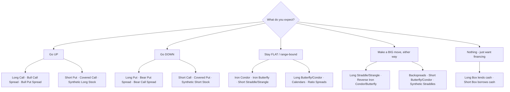

<!-- markdownlint-disable-file -->
# Option Strategies — Complete Study Notes

A long-term study reference compiled from **[Macroption.com](https://www.macroption.com/)**.
It covers **all 74 option strategies** published on the site, each written up with the same
fields so you can compare them quickly and revisit them later without re-learning everything.

> **Date compiled:** 2026-06-21
> **Source:** macroption.com option-strategies section (74 strategy pages)
> **Goal:** an easy-to-revisit reference — plain English first, formulas second.

---

## How to use these notes

* Every strategy uses the **same template**: idea → when to use → outlook → pros → cons → risk
  → max profit → max loss → break-even → notes → plain-English summary.
* Strategies are grouped into **families** (single-leg, spreads, straddles, condors, etc.).
  Strategies in the same family are variations on one core idea, so learn the family first.
* The **plain-English** line at the end of each entry is the fastest way to refresh your memory.
* The **[Final Summary & Comparison](#final-summary--comparison)** at the bottom groups every
  strategy by direction, risk, purpose, and difficulty — start or end your revision there.

### A note on sourcing

Macroption publishes some strategies as full articles (with exact formulas) and many others as
short "stub" pages (just a one-line classification and a payoff chart). Where macroption states a
formula, these notes use it. Where a stub page omits the math, the **standard, well-known formula**
for that structure is supplied so the note stays complete. The payoff math for spreads, butterflies,
condors, and ladders is deterministic, so these standard formulas are reliable.

---

## Quick glossary (plain English)

| Term | Meaning in one line |
|------|---------------------|
| **Call** | Right to **buy** the stock at the strike. Gains when the stock **rises**. |
| **Put** | Right to **sell** the stock at the strike. Gains when the stock **falls**. |
| **Strike** | The fixed price in the option contract. |
| **Premium** | The price you pay (long) or receive (short) for an option. |
| **Long / Short** | Long = you **bought** it. Short = you **sold/wrote** it. |
| **Debit** | Net **cost** to open the position (money goes out). |
| **Credit** | Net **cash received** to open the position (money comes in). |
| **ITM / ATM / OTM** | In / At / Out of the money — strike vs current price. |
| **Break-even (B/E)** | Stock price where the trade makes exactly zero profit/loss. |
| **Max profit / Max loss** | The best and worst outcomes at expiration. |
| **Theta** | Time decay. **Positive** = time helps you (sellers). **Negative** = time hurts you (buyers). |
| **Vega** | Volatility sensitivity. **Long vega** likes rising IV; **short vega** likes falling IV. |
| **Delta** | Directional sensitivity. Near 0 = market-neutral. |
| **Wing width** | Distance between adjacent strikes in butterflies/condors. |

### Risk-profile shorthand used in these notes

* **Limited risk** = the most you can lose is known and capped.
* **Unlimited risk** = losses can grow without a hard cap (short calls / short stock).
* **"Very large" risk** = technically capped only because a stock can't fall below zero, but still big.
* **Income** = you collect premium and want little movement.
* **Directional** = you need the stock to move a particular way to profit.

---

## Table of contents

1. [Single-Leg Strategies](#1-single-leg-strategies-the-building-blocks)
2. [Strategies With the Underlying (Covered & Protective)](#2-strategies-with-the-underlying-covered--protective)
3. [Vertical Spreads](#3-vertical-spreads)
4. [Ladders](#4-ladders)
5. [Straddles](#5-straddles)
6. [Strangles](#6-strangles)
7. [Butterflies](#7-butterflies)
8. [Condors](#8-condors)
9. [Ratio Spreads & Backspreads](#9-ratio-spreads--backspreads)
10. [Calendar Spreads](#10-calendar-spreads)
11. [Diagonal Spreads](#11-diagonal-spreads)
12. [Box Spreads](#12-box-spreads)
13. [Synthetic Positions](#13-synthetic-positions)
14. [Final Summary & Comparison](#final-summary--comparison)

---

## 1. Single-Leg Strategies (the building blocks)

The four positions that every other strategy is built from. Learn these cold — everything else
is just combinations of them.

### 1.1 Long Call

*Also: "buying a call." Bullish · single leg · limited risk.*

* **Idea / how it works:** Buy 1 call. You pay a premium for the right to buy the stock at the
  strike. Value rises as the stock climbs above the strike.
* **When to use:** You expect the stock to rise meaningfully (above strike + premium) before expiry.
* **Market outlook:** Bullish.
* **Pros:** Loss capped at the premium; unlimited upside; small outlay vs buying shares.
* **Cons:** Expires worthless if the stock stays at/below the strike; needs to clear break-even just to start profiting; time decay works against you.
* **Risk profile:** **Limited loss, unlimited profit.**
* **Max profit:** Unlimited (rises 1:1 with the stock above the strike).
* **Max loss:** The premium paid.
* **Break-even:** Strike + premium paid.
* **Notes:** The purest way to bet on a rise with defined risk. P/L per share = MAX(price − strike, 0) − premium.
* **In plain English:** You pay a fee for the right to buy the stock cheaply later. If it soars you win big; if it doesn't, you only lose the fee.

### 1.2 Long Put

*Also: "buying a put." Bearish · single leg · limited risk.*

* **Idea / how it works:** Buy 1 put. You pay a premium for the right to sell the stock at the
  strike. Value rises as the stock falls below the strike.
* **When to use:** You expect the stock to fall (below strike − premium), or you want to hedge a holding.
* **Market outlook:** Bearish.
* **Pros:** Loss capped at the premium; large profit if the stock drops; defined-risk way to be bearish or to insure.
* **Cons:** Expires worthless if the stock stays at/above the strike; time decay hurts; profit ultimately capped (stock can't go below zero).
* **Risk profile:** **Limited loss, limited (but large) profit.**
* **Max profit:** Strike − premium (reached if the stock goes to zero).
* **Max loss:** The premium paid.
* **Break-even:** Strike − premium paid.
* **Notes:** The bearish mirror of the long call. P/L per share = MAX(strike − price, 0) − premium.
* **In plain English:** You pay a fee for the right to sell the stock high while it drops. The lower it falls, the more you make; the worst case is losing the fee.

### 1.3 Short Call (Naked Call)

*Also: "naked call," "uncovered call." Bearish · single leg · **unlimited risk**.*

* **Idea / how it works:** Sell 1 call and collect the premium. You profit if the stock stays
  below the strike so the call expires worthless.
* **When to use:** You expect the stock to stay flat or fall, and want premium income. (Often sells an OTM call.)
* **Market outlook:** Bearish / neutral. Short volatility (gains if IV falls).
* **Pros:** Immediate income; profits from time decay and falling volatility; wins if the stock just doesn't rise.
* **Cons:** **Unlimited loss** if the stock rallies; reward capped at the premium — a dangerous risk/reward skew.
* **Risk profile:** **Unlimited loss, limited profit.**
* **Max profit:** The premium received.
* **Max loss:** Unlimited (grows with the stock above the strike).
* **Break-even:** Strike + premium received.
* **Notes:** Requires margin and active risk management. The naked tail risk is why beginners are steered away.
* **In plain English:** You collect a fee for promising to deliver the stock at the strike. Fine while it stays low, but a big rally can cause unlimited losses.

### 1.4 Short Put (Naked Put)

*Also: "naked put," "uncovered put." Bullish · single leg · large risk.*

* **Idea / how it works:** Sell 1 put and collect the premium. You profit if the stock stays
  above the strike so the put expires worthless.
* **When to use:** You expect the stock to stay flat or rise, want income, and are willing to buy the stock if assigned.
* **Market outlook:** Bullish / neutral. Short volatility (gains if IV falls).
* **Pros:** Immediate income; profits from time decay and falling volatility; risk is capped (unlike a short call).
* **Cons:** Loss can be very large if the stock collapses (you must buy high); risk/reward is usually unfavorable.
* **Risk profile:** **Limited loss (but large), limited profit.**
* **Max profit:** The premium received.
* **Max loss:** Strike − premium (reached if the stock goes to zero).
* **Break-even:** Strike − premium received.
* **Notes:** Same payoff shape as a covered call. A common "get paid to maybe buy the stock" income trade.
* **In plain English:** You collect a fee for promising to buy the stock at the strike. If it stays up you keep the fee; if it crashes you're forced to buy high.

---

## 2. Strategies With the Underlying (Covered & Protective)

These combine **stock + options**. They are how investors generate income on holdings or insure
positions. The word "covered" means a stock position offsets an option's risk.

### 2.1 Covered Call

*Also: "buy-write" (when stock and call are opened together). Neutral-to-bullish · stock + short call · income.*

* **Idea / how it works:** Own the stock **and** sell a call against it. The stock "covers" the
  short call. You collect premium in exchange for capping your upside.
* **When to use:** You hold the stock, expect it flat or slightly up, and want extra income without selling.
* **Market outlook:** Neutral to moderately bullish. Short volatility.
* **Pros:** Generates income; premium cushions small declines and lowers break-even; removes the naked-call tail risk.
* **Cons:** Upside capped above the strike (you may be assigned); still exposed to large downside if the stock falls.
* **Risk profile:** **Large (but not unlimited) downside, capped upside.**
* **Max profit:** Call strike − initial stock price + call premium (reached at/above the strike).
* **Max loss:** Initial stock price − call premium (reached if the stock goes to zero).
* **Break-even:** Initial stock price − call premium.
* **Notes:** Higher strike = more upside room but smaller premium. Best strike ≈ where you expect the stock at expiry. Greeks: +delta, −gamma, −vega, +theta.
* **In plain English:** You own the stock and rent it out by selling a call for income. You give up big gains above the strike, but you get paid and cushioned for small drops.

### 2.2 Covered Put

*Bearish · short stock + short put · income. The "covered" name only protects the downside.*

* **Idea / how it works:** Short the stock **and** sell a put against it (a credit trade). You
  profit if the stock stays at or below the put strike.
* **When to use:** Bearish income view — you expect the stock to drift sideways or down.
* **Market outlook:** Bearish.
* **Pros:** Positive cash flow from both legs; profitable across the whole range at/below the strike.
* **Cons:** **Unlimited loss** if the stock rallies (the short stock drives it); the "covered" label is misleading — no upside protection.
* **Risk profile:** **Unlimited loss, limited profit.**
* **Max profit:** Initial stock price + put premium − put strike (at/below the strike).
* **Max loss:** Unlimited (stock rising).
* **Break-even:** Initial stock price received + put premium received.
* **Notes:** Payoff resembles a short call. The bearish, income-oriented counterpart of the covered call.
* **In plain English:** You short the stock and sell a put for extra income. You keep the max profit while it stays low, but a rally produces unlimited losses.

### 2.3 Protective Put (Married Put)

*Also: "married put." Bullish with insurance · long stock + long put · limited risk.*

* **Idea / how it works:** Own the stock **and** buy a put as downside insurance. The put premium
  is the (non-refundable) cost of protection.
* **When to use:** You're bullish but want a floor under a holding, or fear a near-term drop but don't want to sell.
* **Market outlook:** Bullish (hedged).
* **Pros:** Caps downside to a known amount while keeping unlimited upside; you keep the shares and dividends.
* **Cons:** The premium reduces profit and raises break-even; below the strike you sit at the (limited) max loss.
* **Risk profile:** **Limited loss, unlimited profit.**
* **Max profit:** Unlimited (acts like the stock, minus the put premium).
* **Max loss:** Put strike − initial stock price − put premium.
* **Break-even:** Initial stock price + put premium (always above the strike).
* **Notes:** Payoff resembles a long call (put-call parity), but you own the shares (and get dividends). Behaves like insurance.
* **In plain English:** You own the stock and buy a put as an insurance policy. A drop is cushioned by the put; a rise keeps your gains minus the small insurance cost.

### 2.4 Protective Call

*Bearish with insurance · short stock + long call · limited risk. Mirror of the protective put.*

* **Idea / how it works:** Short the stock **and** buy a call to insure against a rally. The call
  caps the otherwise-infinite risk of a short.
* **When to use:** You're bearish (short the stock) but want protection against a surprise spike up.
* **Market outlook:** Bearish (hedged).
* **Pros:** Caps the short's infinite risk; keeps full downside profit (toward zero) minus the call cost.
* **Cons:** The call premium reduces profit; above the call strike you sit at the (limited) max loss.
* **Risk profile:** **Limited loss, limited (but large) profit.**
* **Max profit:** Initial stock price − call premium (reached if the stock goes to zero).
* **Max loss:** Initial stock price − call premium − call strike (at/above the strike).
* **Break-even:** Initial stock price − call premium (below the strike).
* **Notes:** Payoff resembles a long put (put-call parity). The bearish counterpart of the protective put.
* **In plain English:** You short the stock and buy a call as insurance against a rally. You profit as it falls, with the call capping your loss if it instead spikes up.

### 2.5 Collar

*Bullish but cautious · long stock + long put + short call · limited risk. The only common 3-instrument strategy.*

* **Idea / how it works:** Own the stock, buy a put **below** (protection), and sell a call
  **above** (to pay for the put). It is a covered call + protective put combined.
* **When to use:** To protect a holding cheaply (often near zero net option cost), accepting a capped upside.
* **Market outlook:** Bullish but range-bound / cautious.
* **Pros:** Downside strictly limited by the put; the short call premium offsets (sometimes fully) the put cost — protection can be nearly free.
* **Cons:** Upside capped above the call strike; both profit and loss confined to a narrow band.
* **Risk profile:** **Limited loss, limited profit.**
* **Max profit:** Call strike − initial cost.
* **Max loss:** Initial cost − put strike.
* **Break-even:** Initial cost = stock price + put premium − call premium.
* **Notes:** Call strike must be above the put strike, same expiry, matched sizes. Like a bull spread built around a holding. Risk/reward ≈ 1:1 if the stock starts mid-band.
* **In plain English:** You "collar" the stock between a protective put below and a sold call above. You can't lose much below the put or gain above the call — often for little or no net cost.

---

## 3. Vertical Spreads

Two options of the **same type and expiration, different strikes**. You buy one and sell another to
cap both risk and reward. All four are **limited-risk, limited-reward** — the workhorses of
defined-risk trading. "Debit" spreads cost money to open; "credit" spreads pay you to open.

### 3.1 Bull Call Spread

*Also: "long call spread," "debit call spread." Bullish · debit · limited risk.*

* **Idea / how it works:** Buy a lower-strike call, sell a higher-strike call (same expiry). The
  short call cheapens the trade but caps your upside. Net **debit**.
* **When to use:** You expect a **moderate** rise. (For a big move, a plain long call may be better.)
* **Market outlook:** Bullish.
* **Pros:** Known, limited risk; cheaper than buying the call outright; flexible risk/reward via strikes.
* **Cons:** Profit capped above the higher strike; net cost to enter; time decay can hurt if both strikes are above price.
* **Risk profile:** **Limited risk, limited reward.**
* **Max profit:** Strike difference − net debit (at/above the higher strike).
* **Max loss:** Net debit paid (at/below the lower strike).
* **Break-even:** Lower strike + net debit.
* **Notes:** Strike placement sets the Greeks. Wider strikes = more cost, more risk, more potential profit.
* **In plain English:** Buy a call, sell a higher one to cheapen it. You profit on a measured rise, but your gain stops past the higher strike. Most you can lose is what you paid.

### 3.2 Bull Put Spread

*Also: "short put spread," "credit put spread." Bullish · credit · limited risk.*

* **Idea / how it works:** Sell a higher-strike put, buy a lower-strike put (same expiry) as a
  hedge. Net **credit** — you keep it if the stock holds up.
* **When to use:** You expect the stock to **rise or at least not fall**. An income trade with a "won't drop much" view.
* **Market outlook:** Bullish.
* **Pros:** Premium received up front; known, limited risk; profits from time decay / the stock simply not falling.
* **Cons:** Profit capped at the credit; max loss is usually bigger than the credit collected.
* **Risk profile:** **Limited risk, limited reward.**
* **Max profit:** Net credit received (at/above the higher strike).
* **Max loss:** Strike difference − net credit (at/below the lower strike).
* **Break-even:** Higher strike − net credit.
* **Notes:** *Caution: macroption's "When to Trade" line on this page reads "moderately decrease," which contradicts the rest of the page — the correct reading is **bullish**.* Inverse of the bear put spread.
* **In plain English:** Collect a credit by selling a put, and buy a cheaper lower put for protection. Keep the credit if the stock stays above the higher strike; loss is capped but can exceed the credit.

### 3.3 Bear Call Spread

*Also: "short call spread," "credit call spread." Bearish · credit · limited risk.*

* **Idea / how it works:** Sell a lower-strike call, buy a higher-strike call (same expiry) for
  protection. Net **credit** — you keep it if the stock doesn't rise.
* **When to use:** You expect the stock to **fall or at least not rise**. A hedged short-call income trade.
* **Market outlook:** Bearish.
* **Pros:** Premium up front; known, limited risk (unlike a naked short call); profits from time decay / the stock not rising.
* **Cons:** Profit capped at the credit; max loss usually larger than the credit.
* **Risk profile:** **Limited risk, limited reward.**
* **Max profit:** Net credit received (at/below both strikes).
* **Max loss:** Strike difference − net credit (at/above the higher strike).
* **Break-even:** Lower strike + net credit.
* **Notes:** The hedged, defined-risk way to be bearish via calls. Inverse of the bull call spread.
* **In plain English:** Collect a credit by selling a call, buy a higher call to cap risk. Keep the credit while the stock stays below the lower strike; a rally past the higher strike caps your loss.

### 3.4 Bear Put Spread

*Also: "long put spread," "debit put spread." Bearish · debit · limited risk.*

* **Idea / how it works:** Buy a higher-strike put, sell a lower-strike put (same expiry). The
  short put cheapens the trade but caps your downside profit. Net **debit**.
* **When to use:** You expect a **moderate** decline.
* **Market outlook:** Bearish.
* **Pros:** Known, limited risk; cheaper than buying the put outright; flexible risk/reward.
* **Cons:** Profit capped below the lower strike; net cost to enter; time decay can hurt if both strikes are below price.
* **Risk profile:** **Limited risk, limited reward.**
* **Max profit:** Strike difference − net debit (at/below the lower strike).
* **Max loss:** Net debit paid (at/above the higher strike).
* **Break-even:** Higher strike − net debit.
* **Notes:** Mirror of the bull call spread. Most popular build: long put ITM, short put OTM.
* **In plain English:** Buy a put, sell a lower one to cheapen it. You profit on a measured drop, but your gain stops below the lower strike. Most you can lose is what you paid.

---

## 4. Ladders

A ladder is a **vertical spread plus one extra "rung"** (a third strike). That extra leg changes
the risk profile dramatically — usually adding an unlimited-risk or very-large-risk side, or an
unlimited-profit side. More advanced than plain verticals.

> Worked-example numbers below use strikes 45 / 50 / 55. Risk classifications are macroption's;
> formulas are read from the payoff diagrams.

### 4.1 Bull Call Ladder

*Non-directional · 3 calls · **unlimited loss** on a sharp rise.*

* **Idea / how it works:** A bull call spread **plus an extra short call** at a higher strike
  (buy low call, sell middle call, sell high call). The extra naked call adds unlimited upside risk.
* **When to use:** A refinement of a bull call spread when you want lower cost / higher max profit and do **not** expect a breakout above the top strike.
* **Market outlook:** Non-directional; you want the stock to finish in the middle zone.
* **Pros:** Higher max profit / lower cost than the equivalent bull call spread (extra premium collected).
* **Cons:** **Unlimited loss** if the stock rallies hard above the upper break-even.
* **Risk profile:** **Unlimited loss, limited profit.**
* **Max profit:** ≈ (middle − low strike) − net debit (between the two upper strikes).
* **Max loss:** Unlimited on the upside; limited to the net debit on the downside.
* **Break-even:** Two points (e.g., ≈ 46.6 lower and ≈ 58.4 upper); above the upper one, losses run unlimited.
* **Notes:** The extra short call is the danger. Profit plateaus between the two upper strikes.
* **In plain English:** A bull call spread with one extra call sold for income. Best if the stock lands mid-range; a strong rally causes unlimited losses.

### 4.2 Bull Put Ladder

*Long volatility (bull lean) · 3 puts · big profit on a crash.*

* **Idea / how it works:** A bull put spread **plus an extra long put** at a lower strike (long
  low put, long middle put, short high put). The extra long put gives large downside profit.
* **When to use:** You lean bullish/neutral (keep a credit if it rises) but want a cheap hedge that pays off big if the stock crashes.
* **Market outlook:** Long volatility; profits most on a large **down** move, keeps a small credit on the upside.
* **Pros:** Limited risk; very large profit if the stock falls hard; still collects a credit on a rise.
* **Cons:** Loses most on a small/moderate drift down into the middle zone; needs a real move to shine.
* **Risk profile:** **Limited loss, limited profit** — "but profit can be very large if the stock falls a lot."
* **Max profit:** Very large (toward a crash), e.g., ≈ 4,199 in the worked example.
* **Max loss:** ≈ (high − middle strike) − net credit (between the two lower strikes), e.g., ≈ 301.
* **Break-even:** Two points (≈ 42.0 and ≈ 53.0); above the top strike you keep the net credit.
* **Notes:** Inverse of the bear put ladder. Above the top strike you just keep a small credit.
* **In plain English:** A bull put spread plus an extra long put. If the stock collapses you profit a lot; if it rises you keep a small credit; the only real pain is a modest slide into the middle.

### 4.3 Bear Call Ladder

*Long volatility (bear lean) · 3 calls · **unlimited profit** on a sharp rise.*

* **Idea / how it works:** A bear call spread **plus an extra long call** at a higher strike (short
  low call, long middle call, long high call). The extra long call gives unlimited upside profit.
* **When to use:** You lean bearish/neutral (keep a credit if it falls) but want a breakout play if the stock rallies hard.
* **Market outlook:** Long volatility; profits most on a large **up** move, keeps a small credit on a fall.
* **Pros:** Limited risk; **unlimited profit** on a strong rally; still collects a credit on a fall.
* **Cons:** Loses most on a small/moderate rise into the middle zone; needs a real up-move to pay off.
* **Risk profile:** **Limited loss, unlimited profit.**
* **Max profit:** Unlimited on the upside; capped at the net credit on the downside.
* **Max loss:** ≈ (middle − low strike) − net credit (between the two upper strikes), e.g., ≈ 343.
* **Break-even:** Two points (≈ 46.6 and ≈ 58.4); above the upper one, profit runs unlimited.
* **Notes:** Inverse of the bull call ladder (same strikes, opposite positions).
* **In plain English:** A bear call spread plus an extra long call. A rocket higher pays unlimited; a fall keeps a small credit; the pain zone is a modest rise into the middle.

### 4.4 Bear Put Ladder

*Non-directional · 3 puts · very large loss on a crash.*

* **Idea / how it works:** A bear put spread **plus an extra short put** at a lower strike (short
  low put, short middle put, long high put). The extra naked put creates a very large downside loss.
* **When to use:** A refinement of a bear put spread when you want lower cost / higher max profit and do **not** expect a hard crash below the lowest strike.
* **Market outlook:** Non-directional; you want the stock to finish in the middle zone.
* **Pros:** Higher max profit / lower cost than the equivalent bear put spread (extra premium collected).
* **Cons:** **Very large loss** if the stock falls sharply below the lower break-even.
* **Risk profile:** **Limited loss, limited profit** — "but the loss can be very large if the stock falls a lot."
* **Max profit:** ≈ (middle − low strike) − net debit (between the two lower strikes), e.g., ≈ 301.
* **Max loss:** Very large toward a crash (e.g., ≈ 4,199); limited to the net debit on the upside.
* **Break-even:** Two points (≈ 42.0 and ≈ 53.0); below the lower one, losses grow rapidly.
* **Notes:** Inverse of the bull put ladder. The extra short put is the danger.
* **In plain English:** A bear put spread plus one extra put sold for income. Best if the stock lands mid-range; a deep crash causes huge losses.

---

## 5. Straddles

Straddles are **volatility plays** built on a **single shared strike**. You're betting on how much
the stock moves, not which direction. Long = bet on a big move; short = bet on calm. The covered
versions add stock to tilt the trade bullish.

### 5.1 Long Straddle

*Long volatility · neutral · long call + long put, same strike · limited risk.*

* **Idea / how it works:** Buy a call and a put at the **same strike** (usually ATM) and expiry.
  You profit from a big move in **either** direction.
* **When to use:** You expect a big move but don't know the direction (e.g., earnings, events), and/or expect IV to rise.
* **Market outlook:** Non-directional, long volatility.
* **Pros:** Profits from a large move either way; loss fully known; unlimited upside; gains if IV rises.
* **Cons:** Time decay hurts (negative theta); needs a move big enough to cover **both** premiums; expensive vs a strangle.
* **Risk profile:** **Limited loss, unlimited profit.**
* **Max profit:** Unlimited upside; downside capped at strike − premium.
* **Max loss:** Total premium paid (if the stock ends exactly at the strike).
* **Break-even:** Two points: strike ± total premium paid.
* **Notes:** Worst outcome is the stock sitting still at the strike. The move needs to be big and reasonably quick.
* **In plain English:** Buy a call and a put at the same strike, betting on a big move either way. You lose the premium only if the stock sits still; you win once it moves far enough.

### 5.2 Short Straddle

*Short volatility · neutral · short call + short put, same strike · **unlimited risk**.*

* **Idea / how it works:** Sell a call and a put at the **same strike** and expiry, collecting
  premium. You profit if the stock stays near the strike.
* **When to use:** You expect the stock to stay calm near the strike and/or IV to fall.
* **Market outlook:** Non-directional, short volatility.
* **Pros:** Collects premium; gains from time decay (positive theta) and falling IV.
* **Cons:** **Unlimited loss** on the upside (and very large on the downside); losses accelerate on any big move; needs margin.
* **Risk profile:** **Unlimited loss, limited profit.**
* **Max profit:** Total premium received (if the stock ends exactly at the strike).
* **Max loss:** Unlimited upside; downside = strike − premium.
* **Break-even:** Two points: strike ± total premium received.
* **Notes:** Same short-volatility family as iron butterfly/condor — but unhedged, hence the unlimited risk.
* **In plain English:** Sell a call and a put at one strike and pocket the premium, betting the stock barely moves. A big move in either direction brings unlimited losses.

### 5.3 Strap

*Long volatility, bullish lean · long straddle with **more calls** than puts · limited risk.*

* **Idea / how it works:** A long straddle weighted toward calls (e.g., 2 calls : 1 put) at the
  same strike. Same V-shaped payoff, but profits faster on the upside.
* **When to use:** You expect a big, fast move, **preferably up**, and/or rising IV.
* **Market outlook:** Long volatility with a bullish bias.
* **Pros:** Profits from a move either way, more on the upside; loss limited; gains if IV rises; bias adjustable via the call:put ratio.
* **Cons:** Time decay hurts; loses if IV falls; more expensive than a plain straddle (extra call premium).
* **Risk profile:** **Limited loss, unlimited profit.**
* **Max profit:** Unlimited (greater on the upside). *(Macroption doesn't print an explicit formula.)*
* **Max loss:** Total premium paid (worst at the strike).
* **Break-even:** Two unequal points around the strike; the upside one is reached faster. *(No explicit formula on page.)*
* **Notes:** More lopsided ratio = more bullish/asymmetric; near-equal ratio behaves like a straddle.
* **In plain English:** A straddle tilted bullish by buying extra calls. Big move either way profits, but you make more (and break even sooner) if it rises.

### 5.4 Strip

*Long volatility, bearish lean · long straddle with **more puts** than calls · limited risk.*

* **Idea / how it works:** A long straddle weighted toward puts (e.g., 2 puts : 1 call) at the
  same strike. Same V-shaped payoff, but profits faster on the downside.
* **When to use:** You expect a big move, **with the downside more likely**, and/or rising IV.
* **Market outlook:** Long volatility with a bearish bias.
* **Pros:** Profits either way, more on the downside; loss limited; gains if IV rises; bias adjustable.
* **Cons:** Time decay is the main enemy; loses if IV falls; upside break-even is farther out.
* **Risk profile:** **Limited loss, unlimited profit.**
* **Max profit:** Unlimited (greater on the downside). *(No explicit formula on page.)*
* **Max loss:** Total premium paid (worst at the strike).
* **Break-even:** Two unequal points; the downside one is reached faster. *(No explicit formula on page.)*
* **Notes:** The bearish mirror of the strap.
* **In plain English:** A straddle tilted bearish by buying extra puts. Big move either way profits, but you make more (and break even sooner) if it drops.

### 5.5 Covered Short Straddle

*Also: "covered straddle." Bullish · long stock + short call + short put (same strike) · large downside.*

* **Idea / how it works:** Own the stock **and** sell a straddle (call + put at the same strike)
  against it. A short straddle plus long stock.
* **When to use:** Mildly bullish income view — you own (or want) the stock and expect it near/above the strike.
* **Market outlook:** Bullish.
* **Pros:** Collects double premium on top of the stock; flat max payoff at/above the strike; strike tunes the bias.
* **Cons:** "Covered" only protects the upside — **below the strike, losses grow at double speed** (stock + short put); capped upside.
* **Risk profile:** **Limited profit, large downside.**
* **Max profit:** Strike − initial cost (e.g., ≈ $5.51/share in the example).
* **Max loss:** Strike + initial cost (at zero stock price; e.g., ≈ $84.49/share).
* **Break-even:** One point: 0.5 × (strike + stock price − total premium) — the 0.5 reflects the doubled loss rate below the strike.
* **Notes:** Three payoff zones; the doubled downside loss is the key risk.
* **In plain English:** Own the stock and sell both a call and a put. Above the strike you make a fixed max profit; below it you lose on the stock and the put together, so losses pile up fast.

---

## 6. Strangles

Strangles are straddles' cheaper cousins — same volatility idea, but built on **two different
strikes**. "Strangle" uses out-of-the-money options (call strike higher); "guts" uses in-the-money
options (put strike higher). The payoff shapes match; only the cost and construction differ.

### 6.1 Long Strangle

*Long volatility · neutral · long OTM put + long higher OTM call · limited risk.*

* **Idea / how it works:** Buy an OTM put and an OTM call (call strike > put strike), same expiry.
  Cheaper than a straddle because both legs start out of the money.
* **When to use:** You expect a big move either way but want a cheaper setup than a straddle, and/or rising IV.
* **Market outlook:** Non-directional, long volatility.
* **Pros:** Cheaper than a straddle; limited loss, unlimited upside; gains if IV rises; strikes can be skewed for bias.
* **Cons:** Needs a **bigger** move than a straddle to profit; time decay hurts; wider strikes lower the probability of profit.
* **Risk profile:** **Limited loss, unlimited profit.**
* **Max profit:** Unlimited upside; downside capped at put strike − premium.
* **Max loss:** Total premium paid (if the stock stays between the strikes).
* **Break-even:** Two points: put strike − premium, and call strike + premium.
* **Notes:** Wider strikes = lower cost but lower odds. Narrower strikes behave like a straddle.
* **In plain English:** Buy an OTM call and an OTM put with a gap between them. Cheaper than a straddle, but the stock has to travel farther before you profit.

### 6.2 Short Strangle

*Short volatility · neutral · short OTM put + short higher OTM call · **unlimited risk**.*

* **Idea / how it works:** Sell an OTM put and an OTM call, collecting premium. You profit if the
  stock stays in the wide range between the strikes.
* **When to use:** You expect the stock to stay range-bound and/or IV to fall.
* **Market outlook:** Non-directional, short volatility.
* **Pros:** Collects premium; wide profit zone; gains from time decay and falling IV; wider gap raises the win probability.
* **Cons:** **Unlimited loss** on the upside (large on the downside); losses accelerate on a big move; wider gap lowers the premium.
* **Risk profile:** **Unlimited loss, limited profit.**
* **Max profit:** Total premium received (stock stays between the strikes).
* **Max loss:** Unlimited upside; downside = put strike − premium.
* **Break-even:** Two points: put strike − premium, and call strike + premium.
* **Notes:** The hedged version of this is the iron condor (add long wings).
* **In plain English:** Sell an OTM call and an OTM put and keep the premium while the stock stays in a range. A big move either way brings unlimited risk.

### 6.3 Long Guts

*Long volatility · neutral · long ITM call + long higher ITM put · limited risk.*

* **Idea / how it works:** A long strangle built with **in-the-money** options (put strike >
  call strike). Same payoff shape as a strangle, but costs more up front (both legs have intrinsic value).
* **When to use:** Same as a long strangle — you expect a big move either way.
* **Market outlook:** Non-directional, long volatility.
* **Pros:** Same shape as a long strangle; limited loss, unlimited upside; max loss reduced by the strike distance.
* **Cons:** More expensive up front (both legs ITM); time decay and falling IV hurt; wider strikes push break-evens out.
* **Risk profile:** **Limited loss, unlimited profit.**
* **Max profit:** Unlimited upside.
* **Max loss:** Initial cost − strike distance (e.g., ≈ $3.87/share).
* **Break-even:** Two points: put strike − cost, and call strike + cost.
* **Notes:** Between the strikes both legs are ITM, so the call's gain offsets the put's loss (flat P/L there).
* **In plain English:** A long strangle using in-the-money options. The payoff looks identical to a strangle, but you pay more up front since both options already have value.

### 6.4 Short Guts

*Short volatility · neutral · short ITM call + short higher ITM put · **unlimited risk**.*

* **Idea / how it works:** A short strangle built with **in-the-money** options (put strike >
  call strike). Collects more premium than a short strangle, but you always pay something back at expiry.
* **When to use:** Same as a short strangle — you expect the stock to stay range-bound.
* **Market outlook:** Non-directional, short volatility.
* **Pros:** Collects more premium up front (both legs ITM); capped max profit; same shape as a short strangle.
* **Cons:** **Unlimited loss** on the upside; there's **always** a cash outflow at expiry (at least one leg is ITM).
* **Risk profile:** **Unlimited loss, limited profit.**
* **Max profit:** Initial credit − strike distance (e.g., ≈ $3.87/share).
* **Max loss:** Unlimited upside; downside = put strike − credit.
* **Break-even:** Two points: put strike − credit, and call strike + credit.
* **Notes:** The mirror of long guts; payoff looks like a short strangle.
* **In plain English:** A short strangle using in-the-money options. You take in a big premium but always pay some back, since at least one leg always finishes in the money.

### 6.5 Covered Short Strangle

*Also: "covered strangle." Bullish · long stock + short put + short higher call · large downside.*

* **Idea / how it works:** Own the stock **and** sell a strangle (OTM put + higher OTM call)
  against it. A short strangle plus long stock.
* **When to use:** Mildly bullish income view — you own (or want) the stock and expect it to hold up or rise modestly.
* **Market outlook:** Bullish.
* **Pros:** Collects double premium on top of the stock; flat max profit at/above the call strike; wide profitable region.
* **Cons:** Only the upside is hedged — **below the put strike, losses grow at double speed**; capped upside.
* **Risk profile:** **Limited profit, large downside.**
* **Max profit:** Call strike − initial cost (e.g., ≈ $6.17/share).
* **Max loss:** Put strike + initial cost (at zero stock price; e.g., ≈ $88.83/share).
* **Break-even:** One point, conditional on inputs (≈ stock price − premium, or a 0.5× blend once below the put strike).
* **Notes:** Three payoff zones; the doubled downside below the put strike is the key risk.
* **In plain English:** Own the stock and sell an OTM put and a higher OTM call. Above the call strike you earn a fixed max; below the put strike you lose on the stock and the put together.

---

## 7. Butterflies

Butterflies are **three-strike, limited-risk** structures (legs in a 1-2-1 ratio). **Long**
butterflies profit when the stock pins the **middle strike** (neutral, short-volatility). **Short**
butterflies profit from a **big move** away from the middle (long-volatility). The "iron" versions
mix calls and puts; everything is capped on both sides.

> Macroption fully documents only the **Iron Butterfly**; the others are stub pages, so their
> formulas below are the standard, deterministic butterfly math.

### 7.1 Long Call Butterfly

*Neutral · short volatility · 3 calls (1-2-1) · debit · limited risk.*

* **Idea / how it works:** Buy 1 lower call, sell 2 middle calls, buy 1 higher call (equal spacing).
  Net **debit**. Profits if the stock finishes near the middle strike.
* **When to use:** You expect the stock to sit near a specific price (the middle strike) at expiry.
* **Market outlook:** Neutral, short volatility (wants the price to stand still).
* **Pros:** Cheap; risk limited to the small debit; high reward-to-risk if it pins the middle; benefits from time decay near the middle.
* **Cons:** Max profit only at the exact middle strike; profit capped; three legs/commissions; big moves cause the (capped) loss.
* **Risk profile:** **Limited loss, limited profit.**
* **Max profit:** (middle − lower strike) − net debit (at the middle strike).
* **Max loss:** Net debit paid (outside the wings).
* **Break-even:** Lower strike + net debit, and upper strike − net debit.
* **Notes:** Same payoff as the long put butterfly at the same strikes.
* **In plain English:** A cheap, capped bet that the stock finishes right at the middle strike. Pay a small premium; pin the middle and you win; big moves only cost you the debit.

### 7.2 Long Put Butterfly

*Neutral · short volatility · 3 puts (1-2-1) · debit · limited risk.*

* **Idea / how it works:** Buy 1 higher put, sell 2 middle puts, buy 1 lower put (equal spacing).
  Net **debit**. Identical payoff to the long call butterfly.
* **When to use:** Same as the long call butterfly — you expect pinning near the middle strike.
* **Market outlook:** Neutral, short volatility.
* **Pros / Cons:** Same as the long call butterfly (cheap, capped risk, peak only at the middle, hurt by big moves).
* **Risk profile:** **Limited loss, limited profit.**
* **Max profit:** (higher − middle strike) − net debit (at the middle strike).
* **Max loss:** Net debit paid (outside the wings).
* **Break-even:** Lower strike + net debit, and upper strike − net debit.
* **Notes:** Calls vs puts is just a construction/pricing choice — the payoff shape is the same.
* **In plain English:** The same "pin the middle strike" bet as a long call butterfly, just built from puts.

### 7.3 Short Call Butterfly

*Long volatility · 3 calls (1-2-1) · credit · limited risk. Inverse of the long call butterfly.*

* **Idea / how it works:** Sell 1 lower call, buy 2 middle calls, sell 1 higher call. Net **credit**.
  Profits if the stock moves **away** from the middle strike.
* **When to use:** You expect a large move in either direction (or at least away from the middle).
* **Market outlook:** Non-directional but long volatility (wants a big move).
* **Pros:** Receives a credit; risk capped; profits on a big move either way; benefits from rising IV.
* **Cons:** Max (capped) loss if the stock pins the middle strike; profit also capped; three legs.
* **Risk profile:** **Limited loss, limited profit.**
* **Max profit:** Net credit received (outside the wings).
* **Max loss:** (middle − lower strike) − net credit (at the middle strike).
* **Break-even:** Lower strike + net credit, and upper strike − net credit.
* **Notes:** A cheap, limited-risk way to bet on a breakout. Danger zone is the middle strike.
* **In plain English:** The opposite of a long butterfly: take a credit and **want** the stock to move. A big swing either way lets you keep the credit; pinning the middle is the worst case.

### 7.4 Short Put Butterfly

*Long volatility · 3 puts (1-2-1) · credit · limited risk. Inverse of the long put butterfly.*

* **Idea / how it works:** Sell 1 higher put, buy 2 middle puts, sell 1 lower put. Net **credit**.
  Same payoff as the short call butterfly.
* **When to use:** Same as the short call butterfly — you expect a large move.
* **Market outlook:** Non-directional, long volatility.
* **Pros / Cons:** Same mirror-of-long-butterfly profile (credit received, capped risk, max loss at the middle, profits on big moves).
* **Risk profile:** **Limited loss, limited profit.**
* **Max profit:** Net credit received (outside the wings).
* **Max loss:** (higher − middle strike) − net credit (at the middle strike).
* **Break-even:** Lower strike + net credit, and upper strike − net credit.
* **Notes:** Macroption's page words this "limited potential profit." Same breakout bet as the short call butterfly.
* **In plain English:** Same breakout bet as the short call butterfly, built from puts. Collect a credit, profit on a big move, lose the most if the stock sits at the middle.

### 7.5 Iron Butterfly

*Neutral · short volatility · 4 legs (call spread + put spread) · credit · limited risk.*

* **Idea / how it works:** Sell an ATM call and an ATM put at the **same middle strike**, then buy
  a higher call and a lower put as wings. It's a short straddle hedged by outer wings. Net **credit**.
* **When to use:** You expect the stock to stay near the middle strike, and want defined risk plus time decay.
* **Market outlook:** Neutral, short volatility. Delta ≈ 0, +theta, −vega, −gamma.
* **Pros:** Credit up front; fully hedged, limited risk; positive theta; best risk/reward as wings narrow.
* **Cons:** Max profit only at the exact middle strike; profit capped at the credit; loses if IV rises; four legs.
* **Risk profile:** **Limited loss, limited profit.**
* **Max profit:** Net credit received (at the middle strike).
* **Max loss:** Wing width − net credit (at/beyond either wing).
* **Break-even:** Middle strike ± net credit.
* **Notes:** Essentially a short call spread + short put spread sharing the middle strike. Narrower wings = smaller profit but better risk/reward.
* **In plain English:** Sell an ATM straddle for a fat premium, then buy a call above and a put below as insurance. Keep the most if the stock pins the middle; lose a capped amount if it drifts to a wing.

### 7.6 Reverse Iron Butterfly

*Long volatility · 4 legs · debit · limited risk. The flipped iron butterfly.*

* **Idea / how it works:** Buy an ATM call and an ATM put at the **same middle strike** (a long
  straddle), then sell a lower put and a higher call as wings. Net **debit**.
* **When to use:** You expect a large move in either direction; a defined-risk way to be long volatility.
* **Market outlook:** Non-directional, long volatility (+vega, −theta).
* **Pros:** Defined risk (the debit); profits from a big move either way; gains if IV rises; cheaper/safer than a naked long straddle.
* **Cons:** Max loss if the stock pins the middle strike; profit capped at the wings; time decay hurts; four legs.
* **Risk profile:** **Limited loss, limited profit.**
* **Max profit:** Wing width − net debit (at/beyond either wing).
* **Max loss:** Net debit paid (at the middle strike).
* **Break-even:** Middle strike ± net debit.
* **Notes:** The mirror of the iron butterfly (buy the ATM straddle instead of selling it).
* **In plain English:** Buy the ATM straddle and sell outer wings to cap cost and risk. Pay a debit and profit on a big move; the worst case is the stock pinning the middle.

---

## 8. Condors

Condors are **four-strike, limited-risk** structures — like butterflies but with a **flat profit
zone** instead of a single peak (the two middle strikes are separated). **Long** condors profit
when the stock stays **between** the inner strikes (neutral). **Short / reverse** condors profit
when it moves **outside** the outer strikes (long-volatility). Strikes K1 < K2 < K3 < K4.

> Macroption fully documents only the **Iron Condor**; the others are stub pages, so their formulas
> below are the standard, deterministic condor math.

### 8.1 Long Call Condor

*Neutral · short volatility · 4 calls · debit · limited risk.*

* **Idea / how it works:** Buy 1 call at K1, sell 1 at K2, sell 1 at K3, buy 1 at K4. Net **debit**.
  Profits when the stock stays between the inner strikes (K2–K3).
* **When to use:** You expect the stock to stay range-bound with a **wide** neutral zone.
* **Market outlook:** Neutral / non-directional (short volatility).
* **Pros:** Limited, defined risk; wide flat profit zone; benefits from time decay inside the range.
* **Cons:** Capped profit; four legs/commissions; a large move loses the full debit.
* **Risk profile:** **Limited loss, limited profit.**
* **Max profit:** Wing width − net debit (between K2 and K3).
* **Max loss:** Net debit paid (below K1 or above K4).
* **Break-even:** K1 + net debit, and K4 − net debit.
* **Notes:** Same payoff shape as the long put condor and the iron condor.
* **In plain English:** A bet, built from calls, that the stock drifts sideways between the two middle strikes. Stay in range and you collect the max; run far either way and you only lose the debit.

### 8.2 Long Put Condor

*Neutral · short volatility · 4 puts · debit · limited risk.*

* **Idea / how it works:** Buy 1 put at K4, sell 1 at K3, sell 1 at K2, buy 1 at K1. Net **debit**.
  Identical payoff shape to the long call condor.
* **When to use:** Same as the long call condor — a wide, range-bound neutral view.
* **Market outlook:** Neutral, short volatility.
* **Pros:** Limited risk; wide flat profit zone; benefits from time decay inside the range.
* **Cons:** Capped profit; four legs; full debit lost on a big move.
* **Risk profile:** **Limited loss, limited profit.**
* **Max profit:** Wing width − net debit (between K2 and K3).
* **Max loss:** Net debit paid (below K1 or above K4).
* **Break-even:** K1 + net debit, and K4 − net debit.
* **Notes:** By put-call parity, same risk as the long call condor — choose by strike pricing/liquidity.
* **In plain English:** The same sideways bet as the long call condor, built from puts.

### 8.3 Iron Condor

*Neutral · short volatility · 4 legs (OTM put spread + OTM call spread) · credit · limited risk.*

* **Idea / how it works:** Sell an OTM put spread and an OTM call spread at the same time (buy low
  put, sell higher put, sell higher call, buy highest call). Net **credit**. The most popular income condor.
* **When to use:** You expect the stock to stay in a range so all four options expire worthless and you keep the credit.
* **Market outlook:** Neutral / non-directional. Delta-neutral, +theta, −vega, −gamma.
* **Pros:** Defined, limited risk; positive theta; credit up front; profits if the stock does nothing; better risk/reward as wings narrow.
* **Cons:** Capped profit (the credit); loses if IV rises; losses accelerate toward the inner strikes; four legs; max loss usually exceeds max profit.
* **Risk profile:** **Limited loss, limited profit.**
* **Max profit:** Net credit received (between the inner strikes).
* **Max loss:** Wing width − net credit (at/beyond an outer strike).
* **Break-even:** Short put strike − credit, and short call strike + credit.
* **Notes:** Variation: **broken-wing iron condor** (unequal wings → directional bias). The unhedged version is a short strangle.
* **In plain English:** Sell an OTM put spread and an OTM call spread for a net credit. Profit if the stock stays in the middle range so everything expires worthless; the long wings cap your loss.

### 8.4 Short Call Condor

*Long volatility · 4 calls · credit · limited risk. Inverse of the long call condor.*

* **Idea / how it works:** Sell 1 call at K1, buy 1 at K2, buy 1 at K3, sell 1 at K4. Net **credit**.
  Profits when the stock moves **outside** the outer strikes.
* **When to use:** You expect a large move in either direction (a defined-risk breakout bet).
* **Market outlook:** Long volatility (direction-agnostic, wants movement).
* **Pros:** Limited, defined risk; credit up front; profits from a sharp move either way.
* **Cons:** Capped profit; loses if the stock stalls between the inner strikes; four legs; time decay hurts.
* **Risk profile:** **Limited loss, limited profit.**
* **Max profit:** Net credit received (below K1 or above K4).
* **Max loss:** Wing width − net credit (between K2 and K3).
* **Break-even:** K1 + net credit, and K4 − net credit.
* **Notes:** Mirror image of the long call condor; same shape as the short put condor and reverse iron condor.
* **In plain English:** Built from calls, the opposite of a long call condor: collect a credit and win on a big move out of the middle range; lose the (capped) max if the stock sits still.

### 8.5 Short Put Condor

*Long volatility · 4 puts · credit · limited risk. Inverse of the long put condor.*

* **Idea / how it works:** Sell 1 put at K4, buy 1 at K3, buy 1 at K2, sell 1 at K1. Net **credit**.
  Profits when the stock moves outside the outer strikes.
* **When to use:** You expect a large move either way; a defined-risk, long-volatility bet using puts.
* **Market outlook:** Long volatility.
* **Pros:** Limited, defined risk; credit up front; profits from a sharp move.
* **Cons:** Capped profit; max loss if the stock stalls between the inner strikes; four legs; time decay hurts.
* **Risk profile:** **Limited loss, limited profit.**
* **Max profit:** Net credit received (below K1 or above K4).
* **Max loss:** Wing width − net credit (between K2 and K3).
* **Break-even:** K1 + net credit, and K4 − net credit.
* **Notes:** Same payoff shape as the short call condor (put-call parity).
* **In plain English:** The put-based twin of the short call condor — collect a credit and profit on a breakout; lose the capped max if the stock sits between the middle strikes.

### 8.6 Reverse Iron Condor

*Long volatility · 4 legs (long put spread + long call spread) · debit · limited risk.*

* **Idea / how it works:** Buy the inner strikes, sell the outer strikes (sell low put, buy higher
  put, buy higher call, sell highest call). Net **debit**. The inverse of the iron condor.
* **When to use:** You expect a large move / volatility expansion (e.g., before earnings); a defined-risk breakout bet.
* **Market outlook:** Long volatility (+vega, −theta).
* **Pros:** Limited, defined risk (the debit); profits from a sharp move either way; gains if IV rises; cheaper than a long strangle.
* **Cons:** Capped profit; max loss (the full debit) if the stock stays between the inner strikes; time decay hurts; four legs.
* **Risk profile:** **Limited loss, limited profit.**
* **Max profit:** Wing width − net debit (below K1 or above K4).
* **Max loss:** Net debit paid (between the inner strikes).
* **Break-even:** Inner long put strike − net debit, and inner long call strike + net debit.
* **Notes:** The exact inverse of the iron condor — defined-risk, long-volatility instead of short-volatility income.
* **In plain English:** Buy a put spread and a call spread for a net debit; profit when the stock makes a big move beyond an outer strike. If it stays trapped in the middle, you lose the premium paid.

---

## 9. Ratio Spreads & Backspreads

These use an **unequal number of long and short options** (e.g., 1×2). The key distinction:

* **Ratio spread** = sell **more** than you buy → net short options → income, but a **naked risk side**.
* **Backspread** = buy **more** than you sell → net long options → **long volatility**, capped risk, big-move payoff.

> Notation: K1 = lower strike, K2 = higher strike; "1×2" assumed. Macroption pages are stubs, so
> the formulas below are standard reference; the **risk classifications** are macroption's.

### 9.1 Call Ratio Spread

*Also: "ratio call spread," "bull ratio spread." Neutral / slightly bullish · **unlimited risk**.*

* **Idea / how it works:** Buy 1 lower call (K1), sell 2 higher calls (K2). Usually opened for zero
  cost or a credit. You're net short one extra (naked) call.
* **When to use:** Neutral to mildly bullish — you expect a drift up toward the short strike but **not** a breakout past it.
* **Market outlook:** Non-directional / slightly bullish; short volatility.
* **Pros:** Often free or a credit; profits across a range and on a mild rise into K2; time decay helps.
* **Cons:** **Unlimited loss** on a strong rally (the extra short call is naked); margin-heavy; losses accelerate above the upper break-even.
* **Risk profile:** **Unlimited loss, limited profit.**
* **Max profit:** At K2: (K2 − K1) + credit (or − debit).
* **Max loss:** Unlimited above the upper break-even.
* **Break-even:** Upper B/E = 2·K2 − K1 + credit; lower B/E = K1 + debit (only if opened for a debit).
* **Notes:** More extra short calls = more upside risk. Wrong tool if you're strongly bullish.
* **In plain English:** Buy one call, sell two higher ones, usually for free. Best if the stock drifts up to the short strike; a big rally causes unlimited losses because you sold one call too many.

### 9.2 Put Ratio Spread

*Also: "ratio put spread," "bear ratio spread." Neutral / slightly bearish · large risk.*

* **Idea / how it works:** Buy 1 higher put (K2), sell 2 lower puts (K1). Usually free or a credit.
  Net short one extra (naked) put.
* **When to use:** Neutral to mildly bearish — you expect a drift down toward the short strike but **not** a crash.
* **Market outlook:** Non-directional / slightly bearish; short volatility.
* **Pros:** Often free or a credit; profits across a range and on a mild drop into K1; time decay helps.
* **Cons:** **Very large** loss if the stock drops sharply (capped only because price can't go below zero); assignment risk; margin.
* **Risk profile:** **Limited loss (but very large), limited profit.**
* **Max profit:** At K1: (K2 − K1) + credit (or − debit).
* **Max loss:** (2·K1 − K2) − credit, at zero stock price. Large but finite.
* **Break-even:** Lower B/E = 2·K1 − K2 − credit; upper B/E = K2 − debit (only if opened for a debit).
* **Notes:** "Limited" risk here is only because of the zero floor — treat it as effectively large.
* **In plain English:** Buy one put, sell two lower ones. Best if the stock eases down to the short strike. Unlike the call version, the loss is capped (a stock can only fall to zero) — but that cap can still be very large.

### 9.3 Call Ratio Backspread

*Also: "call backspread." Bullish · long volatility · limited risk.*

* **Idea / how it works:** Sell 1 lower call (K1), buy 2 higher calls (K2). Net long one extra call.
  Often opened for a credit.
* **When to use:** You expect a **big upside breakout** with rising volatility, and want limited risk.
* **Market outlook:** Bullish, long volatility.
* **Pros:** **Unlimited** profit on a strong rally; limited, defined risk; often free or a credit; gains if IV jumps.
* **Cons:** Max loss if the stock stalls at the long strike ("dead zone"); time decay hurts while you wait; needs a sizeable move.
* **Risk profile:** **Limited loss, unlimited profit.**
* **Max profit:** Unlimited above the upper break-even.
* **Max loss:** At K2: (K2 − K1) − credit (or + debit).
* **Break-even:** Upper B/E = 2·K2 − K1 − credit; lower B/E = K1 + credit.
* **Notes:** The opposite of the call ratio spread — net long options, capped downside, uncapped upside.
* **In plain English:** Sell one call, buy two higher ones, often for a small credit. A big upside breakout pays unlimited; the worst case is the stock drifting up to the long strike and stalling.

### 9.4 Put Ratio Backspread

*Also: "put backspread." Bearish · long volatility · limited risk.*

* **Idea / how it works:** Sell 1 higher put (K2), buy 2 lower puts (K1). Net long one extra put.
  Often opened for a credit.
* **When to use:** You expect a **sharp sell-off** with rising volatility, and want limited risk.
* **Market outlook:** Bearish, long volatility.
* **Pros:** Large profit on a crash; limited, defined risk; often free or a credit; gains if IV jumps (puts gain in sell-offs).
* **Cons:** Max loss if the stock stalls at the long strike; time decay hurts while you wait; profit capped by the zero floor.
* **Risk profile:** **Limited loss, limited profit** — "but profit can be very large if the stock falls a lot."
* **Max profit:** (2·K1 − K2) + credit, at zero stock price. Large but finite.
* **Max loss:** At K1: (K2 − K1) − credit (or + debit).
* **Break-even:** Upper B/E = K2 − credit; lower B/E = 2·K1 − K2 + credit.
* **Notes:** The long-volatility mirror of the put ratio spread.
* **In plain English:** Sell one put, buy two lower ones, often for a small credit. A sharp sell-off pays big; the worst case is the stock drifting down to the long strike and stalling.

---

## 10. Calendar Spreads

Also called **time spreads** or **horizontal spreads**. Two options of the **same type and strike,
but different expirations**. You profit from the **faster time decay of the near-term option**.
Because two expirations are involved, exact max profit and break-evens can't be written as clean
formulas — they depend on implied volatility and must be modeled.

> Macroption's calendar pages are stubs; the leg definitions are macroption's, the rest is standard reference.

### 10.1 Long Calendar Call Spread

*Neutral · long volatility · sell near-term call + buy far-term call (same strike) · debit.*

* **Idea / how it works:** Sell a near-term call and buy a longer-dated call at the **same strike**
  (often ATM). Net **debit**. The near call decays faster than the far call.
* **When to use:** You expect the stock to sit near the strike short-term, and/or expect IV to rise.
* **Market outlook:** Neutral on direction; long volatility (+vega); positive near-term time decay.
* **Pros:** Limited, defined risk (the debit); cheaper than buying the far call outright; profits from near-term decay; benefits if IV rises; the short leg can be rolled.
* **Cons:** Limited profit; **narrow** profit zone around the strike; loses on a big move either way; hurt by falling IV; early-assignment risk on the short leg.
* **Risk profile:** **Limited risk, limited reward.**
* **Max profit:** No clean formula; roughly maximized with the stock **at the strike at near-term expiry**.
* **Max loss:** Limited to the net debit paid (on a large move away from the strike).
* **Break-even:** Two points bracketing the strike (depend on IV/time; no simple formula).
* **Notes:** The engine is the near leg's faster decay. It likes rising IV and dislikes an IV crush.
* **In plain English:** Sell a soon-to-expire call and buy a longer-dated one at the same strike. You're betting the stock stands still near that strike while the near option melts faster than the one you own.

### 10.2 Long Calendar Put Spread

*Neutral · long volatility · sell near-term put + buy far-term put (same strike) · debit.*

* **Idea / how it works:** Sell a near-term put and buy a longer-dated put at the **same strike**.
  Net **debit**. Behaves like the long calendar call, built from puts.
* **When to use:** Stock range-bound near the strike short-term, and/or rising IV.
* **Market outlook:** Neutral; long volatility; positive near-term time decay.
* **Pros:** Limited, defined risk; cheaper than the far put outright; profits from near-term decay; gains if IV rises; rollable short leg.
* **Cons:** Limited profit; narrow profit zone; loses on a big move; hurt by falling IV; early-assignment risk on the short put.
* **Risk profile:** **Limited risk, limited reward.**
* **Max profit:** No clean formula; roughly maximized with the stock at the strike at near-term expiry.
* **Max loss:** Limited to the net debit paid.
* **Break-even:** Two points bracketing the strike (depend on IV/time).
* **Notes:** Functionally near-identical to the long calendar call (same neutral, long-vega, positive-theta tent).
* **In plain English:** Same idea as the call calendar but using puts: sell a near-term put, buy a longer-dated one at the same strike. Profit if the stock hovers near the strike and/or volatility climbs.

### 10.3 Short Calendar Call Spread

*Neutral-but-wants-movement · short volatility · buy near-term call + sell far-term call (same strike) · credit.*

* **Idea / how it works:** Buy a near-term call and sell a longer-dated call at the **same strike**.
  Net **credit**. The inverse of the long calendar call.
* **When to use:** You expect a **big move** in either direction and/or a **drop in IV** before near-term expiry.
* **Market outlook:** Direction-neutral but wants movement; short volatility (−vega).
* **Pros:** Net credit; profits if the stock moves far from the strike; benefits from falling IV.
* **Cons:** Limited reward; loses if the stock pins the strike; hurt by rising IV; after the near leg expires, the **short far-dated call is naked** (open-ended risk).
* **Risk profile:** **Limited reward; risk limited if closed by near-term expiry, but uncapped if the far call is left naked.**
* **Max profit:** ≈ the net credit (stock moves far from the strike).
* **Max loss:** At the strike at near-term expiry; uncapped if the far leg is left naked.
* **Break-even:** Two points around the strike; profitable **outside** that band.
* **Notes:** A short-vega bet that wants a big move or an IV collapse. Manage the naked far leg carefully.
* **In plain English:** Flip the normal calendar: buy the near call, sell the longer one, collect a credit. You win on a big move or a volatility drop; you lose if the stock sits on the strike.

### 10.4 Short Calendar Put Spread

*Neutral-but-wants-movement · short volatility · buy near-term put + sell far-term put (same strike) · credit.*

* **Idea / how it works:** Buy a near-term put and sell a longer-dated put at the **same strike**.
  Net **credit**. The inverse of the long calendar put.
* **When to use:** You expect a big move either way and/or a fall in IV before near-term expiry.
* **Market outlook:** Direction-neutral but wants movement; short volatility.
* **Pros:** Net credit; profits on a large move; benefits from falling IV.
* **Cons:** Limited reward; loses if the stock pins the strike; hurt by rising IV; after the near leg expires, the **short far put is naked** (large but strike-bounded risk).
* **Risk profile:** **Limited reward; risk limited if closed by near-term expiry, else large (capped by the zero floor).**
* **Max profit:** ≈ the net credit (stock moves far from the strike).
* **Max loss:** At the strike at near-term expiry; large if the far leg is left naked.
* **Break-even:** Two points around the strike; profitable outside that band.
* **Notes:** Built from puts, so the naked far-leg risk is large but capped (strike → 0), unlike the call version's unlimited risk.
* **In plain English:** The put version of the short calendar: buy the near put, sell the longer one, take a credit. Profit from a big move or a volatility drop; lose if the stock parks on the strike.

### 10.5 Double Calendar Spread

*Neutral · long volatility · two calendars at two strikes · debit.*

* **Idea / how it works:** Run **two long calendars at two different strikes** (e.g., a put calendar
  below and a call calendar above) — sell the near-term options, buy the far-term ones. Net **debit**.
* **When to use:** You expect the stock to stay in a **range**, and/or rising IV, but want a **wider** profit zone than a single calendar.
* **Market outlook:** Neutral / range-bound; long volatility; positive time decay.
* **Pros:** Wider profit range (two peaks); limited, defined risk; positive theta and vega; strike spacing tunes the width.
* **Cons:** Costs more than a single calendar; profit still limited; loses if the stock breaks well outside the strikes; complex; the payoff can dip between the strikes.
* **Risk profile:** **Limited risk, limited reward.**
* **Max profit:** No simple formula; tends to peak near one of the two strikes at near-term expiry.
* **Max loss:** Limited to the net debit paid (on a breakout beyond the strikes).
* **Break-even:** Generally two outer break-even points (depend on IV/time).
* **Notes:** Often built with an OTM put calendar + OTM call calendar bracketing the price. Related to the double diagonal.
* **In plain English:** Two calendar spreads at once — one lower, one higher — so your profitable zone is a wide range instead of a single point.

---

## 11. Diagonal Spreads

Like calendars, but the two options have **different strikes AND different expirations**. This adds
a directional tilt on top of the time-decay engine. The famous **"poor man's covered call"** is a
long diagonal call spread. Exact payoffs depend on the specific strikes, so they're modeled, not
formula'd.

> Macroption's diagonal pages are stubs; leg definitions are macroption's, the rest is standard reference.

### 11.1 Long Diagonal Call Spread

*Neutral-to-bullish · buy far-term lower call + sell near-term higher call · debit.*

* **Idea / how it works:** Buy a longer-dated, lower-strike (often ITM) call and sell a shorter-dated,
  higher-strike (OTM) call. Net **debit**. The structure behind the "poor man's covered call."
* **When to use:** Mildly bullish — you expect a gradual rise, want cheaper long-call exposure, and/or plan to roll the short call for income.
* **Market outlook:** Neutral-to-bullish; positive near-term time decay; often long vega.
* **Pros:** Limited, defined risk (the debit); cheaper than the far call outright; collects near-term decay; the short call can be rolled monthly for income; benefits from rising IV.
* **Cons:** Profit capped by the short strike each cycle; complex (two strikes + two expirations); early-assignment risk; loses if the stock falls materially or spikes far too fast.
* **Risk profile:** **Limited risk, limited reward.**
* **Max profit:** No clean formula; roughly maximized with the stock near the short strike at near-term expiry.
* **Max loss:** Limited to the net debit paid (if the stock falls far).
* **Break-even:** Depends on strikes and the far call's value at near-term expiry; no simple formula.
* **Notes:** A hybrid of a vertical and a calendar. The "poor man's covered call" uses a LEAPS-style long call.
* **In plain English:** Buy a longer-dated call and sell a shorter-dated higher one — a cheaper, leveraged stand-in for a covered call. Lean mildly bullish, collect decay, and keep selling new near-term calls.

### 11.2 Long Diagonal Put Spread

*Neutral-to-bearish · buy far-term higher put + sell near-term lower put · debit.*

* **Idea / how it works:** Buy a longer-dated, higher-strike (often ITM) put and sell a shorter-dated,
  lower-strike (OTM) put. Net **debit**. The "poor man's covered put."
* **When to use:** Mildly bearish — gradual decline expected, cheaper long-put exposure, and/or roll the short put for income.
* **Market outlook:** Neutral-to-bearish; positive near-term time decay; often long vega.
* **Pros:** Limited, defined risk; cheaper than the far put outright; collects near-term decay; short put rollable for income; benefits from rising IV.
* **Cons:** Profit capped by the short strike each cycle; complex; early-assignment risk; loses if the stock rises or crashes too fast.
* **Risk profile:** **Limited risk, limited reward.**
* **Max profit:** No simple formula; roughly maximized with the stock near the short strike at near-term expiry.
* **Max loss:** Limited to the net debit paid (if the stock rises far).
* **Break-even:** Depends on strikes and the far put's value at near expiry; no simple formula.
* **Notes:** The mirror of the long diagonal call, oriented mildly bearish.
* **In plain English:** Buy a longer-dated put and sell a shorter-dated lower one for a net debit. Lean mildly bearish, pocket decay, and roll the short put for income.

### 11.3 Short Diagonal Call Spread

*Short volatility (bearish-to-neutral lean) · sell far-term call + buy near-term call · usually credit · large risk.*

* **Idea / how it works:** Sell the longer-dated call and buy the shorter-dated call at a different
  strike. Usually a **credit**. The inverse of the long diagonal call.
* **When to use:** You expect **falling IV** and/or a move that erodes the longer-dated call you're short.
* **Market outlook:** Depends on strikes; broadly short volatility, often bearish-to-neutral.
* **Pros:** Usually a net credit; benefits from falling IV; profits if the stock moves as anticipated.
* **Cons:** Limited reward; once the near long call is gone, the **far call is naked with unlimited upside risk**; hurt by rising IV; complex.
* **Risk profile:** **Limited reward; risk can be large/unlimited (short far-dated call).**
* **Max profit:** ≈ the net credit plus favorable movement; no simple formula.
* **Max loss:** Potentially unlimited (short far call); no simple formula.
* **Break-even:** Depends on strikes and the far call's value at near expiry; no simple formula.
* **Notes:** A short-vega structure. The naked far-call exposure makes risk control essential.
* **In plain English:** Sell the longer-dated call, buy a shorter-dated one, collect a credit, betting volatility falls. The catch: once the near call you own expires, you're short a naked longer-dated call.

### 11.4 Short Diagonal Put Spread

*Short volatility (bullish-to-neutral lean) · sell far-term put + buy near-term put · usually credit · large risk.*

* **Idea / how it works:** Sell the longer-dated put and buy the shorter-dated put at a different
  strike. Usually a **credit**. The inverse of the long diagonal put.
* **When to use:** You expect falling IV and/or a move that erodes the longer-dated put you're short.
* **Market outlook:** Depends on strikes; broadly short volatility, often bullish-to-neutral.
* **Pros:** Usually a net credit; benefits from falling IV; profits if the stock moves favorably.
* **Cons:** Limited reward; once the near long put is gone, the **far put is naked with large (strike-bounded) risk**; hurt by rising IV; complex.
* **Risk profile:** **Limited reward; risk can be large (short far-dated put, capped by the zero floor).**
* **Max profit:** ≈ the net credit plus favorable movement; no simple formula.
* **Max loss:** Potentially large (short far put), capped by the zero floor; no simple formula.
* **Break-even:** Depends on strikes and the far put's value at near expiry; no simple formula.
* **Notes:** The mirror of the short diagonal call; risk is large but capped (strike → 0).
* **In plain English:** Sell a longer-dated put, buy a shorter-dated one, collect a credit, betting volatility falls. After the near put you own expires, you're left short a longer-dated put.

### 11.5 Double Diagonal Spread

*Neutral · long volatility · a call diagonal + a put diagonal · debit.*

* **Idea / how it works:** Sell a near-term OTM strangle and buy a longer-dated, wider strangle around
  it — essentially an **iron condor whose long wings expire later**. Net **debit**.
* **When to use:** You expect the stock to stay in a range through near-term expiry, and/or rising IV, with a wide profit tent.
* **Market outlook:** Neutral / range-bound; long volatility; positive near-term time decay.
* **Pros:** Wide profit zone (a plateau); collects near-term theta; positive vega; defined risk while both expirations are on; flexible.
* **Cons:** Complex four-leg, two-expiration, multi-strike position; profit limited; loses on a breakout; hurt by falling IV; leftover long strangle to manage after the near shorts expire.
* **Risk profile:** **Limited risk, limited reward.**
* **Max profit:** No simple formula; peaks near the short strikes at near-term expiry.
* **Max loss:** Limited to the net debit paid (on a breakout).
* **Break-even:** Generally two outer break-even points with a profitable plateau between.
* **Notes:** Think "iron condor + calendar." Differs from the double calendar by using different strikes on the long legs (a wider tent).
* **In plain English:** Sell a near-term strangle and buy a wider, longer-dated strangle around it — an iron condor whose protective wings expire later. Profit if the stock stays in a fairly wide range.

---

## 12. Box Spreads

A box is a **fully hedged four-leg arbitrage / financing** position — a bull call spread + a bear
put spread (or the credit versions) on the **same two strikes**. The payoff is **fixed = the distance
between the strikes**, regardless of where the stock goes. It's used to **lend or borrow cash** at an
implied interest rate, not to bet on direction.

### 12.1 Long Box Spread

*Non-directional · financing / arbitrage · debit (lends cash, like a bond).*

* **Idea / how it works:** Buy a call spread and a put spread on the same two strikes (long call +
  short call + long put + short put). The four legs lock in a fixed payoff = the strike distance. Net **debit**.
* **When to use:** Arbitrage (when the box is mispriced) or to **lend cash** at an implied rate — it behaves like a zero-coupon bond.
* **Market outlook:** None — the payoff is constant at any stock price.
* **Pros:** Fixed, known payoff; near risk-free in market terms; earns an interest-like return if entered below fair value.
* **Cons:** Four-leg commissions can swallow the thin profit; the cash only returns at expiration (time-value matters); early-assignment risk on American options.
* **Risk profile:** **Near risk-free in direction; real risks are execution, financing, and early assignment.**
* **Max profit / loss:** Payoff at expiry = strike distance; net result = strike distance − net debit (a small, fixed amount).
* **Break-even:** Not directional — flat across all stock prices. Profit depends on entry price vs the present value of the strike distance.
* **Notes:** ⚠️ "Risk-free" only on paper — the 2018 Robinhood box-spread blow-up shows how oversized boxes + early assignment can wipe out an account.
* **In plain English:** Combine a bull call spread and a bear put spread on the same strikes to lock in a fixed payoff no matter what the stock does. You pay cash now and get a fixed amount later — like buying a bond.

### 12.2 Short Box Spread

*Non-directional · financing / arbitrage · credit (borrows cash, like a loan).*

* **Idea / how it works:** The inverse of the long box — a bear call spread + a bull put spread on
  the same two strikes. Brings in cash now; you repay the fixed strike distance at expiration. Net **credit**.
* **When to use:** As a **synthetic loan** — borrow cash now at an implied rate close to money-market rates; or arbitrage a mispriced box.
* **Market outlook:** None — payoff constant at any stock price.
* **Pros:** Positive cash up front (like receiving a loan); fixed, known outcome; potentially cheap financing.
* **Cons:** A small fixed loss (the interest) if fairly priced; four-leg costs and margin; early-assignment risk.
* **Risk profile:** **Near risk-free in direction; real risks are execution, margin, and early assignment.**
* **Max profit / loss:** Obligation at expiry = strike distance; net result = credit received − strike distance (a small, fixed cost = the implied interest).
* **Break-even:** Not directional — flat across all stock prices.
* **Notes:** ⚠️ Same caution as the long box: treating it as "riskless" and oversizing it (American options + assignment) is exactly the Robinhood "1R0NYMAN" failure mode.
* **In plain English:** The reverse of a long box: take cash in now and repay a fixed amount later — a synthetic loan. Not truly risk-free: execution, margin, and early assignment can bite if you oversize it.

---

## 13. Synthetic Positions

A **synthetic** combines options and/or stock to **replicate the payoff of another position** via
**put-call parity**. The single most important thing for each is *what it replicates and why* — the
payoff math is just the math of the position being copied. People use synthetics for capital
efficiency, to get around short-sale restrictions, for arbitrage, or to adjust an existing position.

### Put-call parity cheat sheet (the "synthetic matrix")

Base identity at one strike $K$ (ignoring interest/dividends):

$$S + P = C + K \quad\Longleftrightarrow\quad S = C - P + K$$

where $S$ = stock, $C$ = call, $P$ = put. The six core single-position equivalents (same strike & expiry):

| Real position | Synthetic equivalent |
|---------------|----------------------|
| Long stock | long call + short put |
| Short stock | short call + long put |
| Long call | long stock + long put (= protective put) |
| Short call | short stock + short put |
| Long put | short stock + long call |
| Short put | long stock + short call (= covered call) |

> ⚠️ **Direction-label caution:** Macroption's pages label a few short-put/short-call synthetics with
> reversed directions (e.g., "synthetic covered call = bearish"). Standard theory — used in these
> notes — treats a **short put as bullish/neutral** and a **short call as bearish/neutral**.

### 13a. Synthetic single positions

#### 13.1 Synthetic Long Stock

*Bullish · long call + short put (same strike) · ≈ owning the stock.*

* **Idea:** Buy a call + sell a put at the same strike → an upward-sloping payoff identical to long stock, for almost no upfront cash.
* **When to use:** Long exposure with little capital; capital efficiency; arbitrage construction.
* **Outlook:** Bullish. **Risk profile:** unlimited upside, large downside (mirrors stock).
* **Max profit:** Unlimited. **Max loss:** ≈ strike + net debit (to zero). **Break-even:** strike + (call − put premium).
* **Notes:** No dividends (you don't own shares); short put implies margin. Add a strike gap → it becomes a Long Combo.
* **In plain English:** A call plus a short put at the same strike behaves exactly like owning the stock, but ties up almost no cash — the trade-off is no dividends and full downside.

#### 13.2 Synthetic Short Stock

*Bearish · short call + long put (same strike) · ≈ shorting the stock.*

* **Idea:** Sell a call + buy a put at the same strike → a downward-sloping payoff identical to short stock.
* **When to use:** Short exposure when shorting shares is hard/expensive; capital efficiency; arbitrage.
* **Outlook:** Bearish. **Risk profile:** limited profit (to zero), **unlimited loss** (mirrors short stock).
* **Max profit:** ≈ strike − net cost (at zero). **Max loss:** Unlimited. **Break-even:** ≈ strike + net credit.
* **Notes:** Add a strike gap → Short Combo. Behaves differently on dividends/borrow than a real short.
* **In plain English:** A short call plus a long put mimics shorting the stock without borrowing shares — you profit as it falls, with unlimited risk if it rises.

#### 13.3 Synthetic Long Call

*Bullish · long stock + long put · = a protective put.*

* **Idea:** Own the stock + buy a put → payoff identical to a long call at the put's strike.
* **When to use:** You hold the stock but want capped downside; convert a holding into a capped-risk bullish position.
* **Outlook:** Bullish. **Risk profile:** limited loss, unlimited profit.
* **Max profit:** Unlimited. **Max loss:** (stock price − strike) + put premium. **Break-even:** ≈ stock price + put premium.
* **Notes:** Unlike a plain call, you own the shares so you **collect dividends** — but you pay full price for the stock (not a low-capital play).
* **In plain English:** Owning the stock and buying a put behaves just like holding a call — capped downside, open upside — and you still get dividends.

#### 13.4 Synthetic Long Put

*Bearish · short stock + long call · = a long put.*

* **Idea:** Short the stock + buy a call → payoff identical to a long put.
* **When to use:** Bearish speculation/protection when you're (or want to be) short the stock but want capped upside risk.
* **Outlook:** Bearish. **Risk profile:** limited loss, large profit (to zero).
* **Max profit:** ≈ strike − net cost (at zero). **Max loss:** ≈ (call strike − short price) + call premium. **Break-even:** ≈ short price − call premium.
* **Notes:** Inherits all short-sale burdens (margin, borrow, you owe dividends).
* **In plain English:** Shorting the stock and buying a call reproduces a long put — you profit as it drops, with the call capping your loss if it rises.

#### 13.5 Synthetic Short Call

*Bearish · short stock + short put · = a short call.*

* **Idea:** Short the stock + sell a put → payoff identical to a short call.
* **When to use:** Bearish/neutral income view; construct short-call exposure via parity.
* **Outlook:** Bearish. **Risk profile:** **unlimited loss**, limited profit.
* **Max profit:** ≈ net credit (stock below strike). **Max loss:** Unlimited. **Break-even:** ≈ short price + net credit.
* **Notes:** Same naked-call tail risk as a real short call, plus short-stock burdens.
* **In plain English:** Shorting the stock and selling a put behaves like selling a call — keep the premium while it stays low, unlimited loss if it rallies.

#### 13.6 Synthetic Short Put

*Bullish/neutral · long stock + short call · = a covered call.*

* **Idea:** Buy the stock + sell a call → payoff identical to a short put. (Literally a covered call.)
* **When to use:** Income / mildly bullish view when you also want to hold the shares.
* **Outlook:** Bullish/neutral *(macroption labels this "bearish" — appears to be a site error)*. **Risk profile:** limited profit, large risk (to zero).
* **Max profit:** ≈ strike − initial cost (at/above the strike). **Max loss:** Initial cost (at zero). **Break-even:** Initial cost (= stock price − call premium).
* **Notes:** Same economic position as the Synthetic Covered Call (both = a short put).
* **In plain English:** Buying the stock and selling a call gives the same payoff as selling a put — it's a covered call wearing a "short put" label.

#### 13.7 Long Combo

*Bullish · long higher-strike call + short lower-strike put · ≈ synthetic long stock with a gap.*

* **Idea:** Buy a call and sell a put with the **call strike higher than the put strike**. Between the strikes the P/L is flat; above the call strike it acts like a long call, below the put strike like a short put. Often a net credit.
* **When to use:** Bullish, low/zero-cost directional bet that tolerates a flat "dead zone" between strikes.
* **Outlook:** Bullish. **Risk profile:** unlimited profit, large loss (to zero).
* **Max profit:** Unlimited. **Max loss:** put strike − initial cash flow (at zero). **Break-even:** depends on net cash flow; never between the strikes.
* **Notes:** Same as synthetic long stock but with a strike gap that flattens the mid-range.
* **In plain English:** A bullish bet from a higher-strike long call and a lower-strike short put, often free to put on, with a flat stretch in between where nothing changes.

#### 13.8 Short Combo

*Bearish · long lower-strike put + short higher-strike call · ≈ synthetic short stock with a gap.*

* **Idea:** Buy a put and sell a call with the **call strike higher than the put strike**. Flat between the strikes; above the call strike losses grow, below the put strike profit grows. Often a net credit.
* **When to use:** Bearish, low/zero-cost directional bet with a flat mid-range.
* **Outlook:** Bearish. **Risk profile:** **unlimited loss**, large profit (to zero).
* **Max profit:** put strike + initial cash flow (at zero). **Max loss:** Unlimited (above the call strike). **Break-even:** depends on net cash flow; never between the strikes.
* **Notes:** The exact inverse of the long combo.
* **In plain English:** A bearish bet from a lower-strike long put and a higher-strike short call, often a small credit, with unlimited risk if the stock rallies above the call strike.

#### 13.9 Synthetic Covered Call

*Bullish/neutral · a single short put · = a covered call.*

* **Idea:** A covered call (long stock + short call) equals a single **short put** — so you can just sell a put.
* **When to use:** Covered-call economics in one leg (simpler, pure credit) rather than buying stock and selling a call.
* **Outlook:** Bullish/neutral *(macroption labels "bearish" — appears to be a site error)*. **Risk profile:** limited risk (large) and limited profit — identical to a short put.
* **Max profit:** Net premium received. **Max loss:** strike − premium (at zero). **Break-even:** strike − premium.
* **Notes:** No dividends (no shares held), unlike a real covered call.
* **In plain English:** Instead of buying shares and writing a call, just sell a put — identical payoff, in one trade.

#### 13.10 Synthetic Covered Put

*Bearish/neutral · a single short call · = a covered put.*

* **Idea:** A covered put (short stock + short put) equals a single **short call** — so you can just sell a call.
* **When to use:** Covered-put economics in one leg rather than shorting stock and selling a put.
* **Outlook:** Bearish/neutral *(macroption labels "bullish" — appears to be a site error)*. **Risk profile:** **unlimited risk**, limited profit — identical to a short call.
* **Max profit:** Net premium received. **Max loss:** Unlimited. **Break-even:** strike + premium.
* **Notes:** Same naked-call tail risk as a plain short call.
* **In plain English:** Instead of shorting shares and writing a put, just sell a call — identical payoff, with the usual unlimited short-call risk.

### 13b. Synthetic straddles & strangles

These combine **stock with options at double size** to recreate a straddle or strangle. Long
versions = long volatility (limited loss / unlimited profit); short versions = short volatility
(unlimited risk / limited profit). The payoff equals the straddle/strangle they replicate.

#### 13.11 Long Call Synthetic Straddle

*Long volatility · short stock + 2 long calls (same strike) · = a long straddle.*

* **Idea:** Short the stock + buy 2 calls at one strike. The short stock + one call acts like a put, so the whole thing = a long straddle.
* **When to use:** Big move expected either way; you prefer to build the put side synthetically.
* **Outlook:** Long volatility, neutral. **Risk profile:** limited loss, unlimited profit.
* **Max profit:** Unlimited up (large down). **Max loss:** net debit (at the strike). **Break-even:** strike ± net debit.
* **Notes:** Requires short-selling the stock (borrow costs, you owe dividends).
* **In plain English:** A long straddle in disguise — short the stock and buy two calls, which together behave like a call + put.

#### 13.12 Long Put Synthetic Straddle

*Long volatility · long stock + 2 long puts (same strike) · = a long straddle.*

* **Idea:** Own the stock + buy 2 puts at one strike. The long stock + one put acts like a call → a long straddle.
* **When to use:** Big move expected; you prefer the long-stock build (no short selling, collect dividends).
* **Outlook:** Long volatility, neutral. **Risk profile:** limited loss, unlimited profit.
* **Max profit:** Unlimited up (large down). **Max loss:** net debit (at the strike). **Break-even:** strike ± net debit.
* **Notes:** High upfront cash (you buy the stock). Easier to trade than the call version (no shorting).
* **In plain English:** Same as a long straddle, built by holding the stock and buying two puts — avoids short selling.

#### 13.13 Short Call Synthetic Straddle

*Short volatility · long stock + 2 short calls (same strike) · = a short straddle.*

* **Idea:** Own the stock + sell 2 calls at one strike. Long stock + one short call = a short put, so the whole thing = a short straddle.
* **When to use:** You expect the stock to stay range-bound near the strike (premium collection).
* **Outlook:** Short volatility, neutral. **Risk profile:** **unlimited risk**, limited profit.
* **Max profit:** Net credit (at the strike). **Max loss:** Unlimited up (large down). **Break-even:** strike ± net credit.
* **Notes:** Resembles an over-written stock holding; assignment/margin risk.
* **In plain English:** A short straddle in disguise — hold the stock and sell two calls. Keep the premium if it sits still; heavy losses on a sharp move.

#### 13.14 Short Put Synthetic Straddle

*Short volatility · short stock + 2 short puts (same strike) · = a short straddle.*

* **Idea:** Short the stock + sell 2 puts at one strike. Short stock + one short put = a short call → a short straddle.
* **When to use:** Range-bound, low-volatility view near the strike; you prefer the short-stock build.
* **Outlook:** Short volatility, neutral. **Risk profile:** **unlimited risk**, limited profit.
* **Max profit:** Net credit (at the strike). **Max loss:** Unlimited up (large down). **Break-even:** strike ± net credit.
* **Notes:** Requires short selling (margin, you owe dividends).
* **In plain English:** Another short straddle build — short the stock and sell two puts, which act like a short call + short put.

#### 13.15 Long Call Synthetic Strangle

*Long volatility · short stock + 2 long calls (different strikes) · = a long strangle.*

* **Idea:** Short the stock + buy 2 calls at different strikes. The short stock + lower call mimics the strangle's put.
* **When to use:** Big move expected, cheaper than a straddle (wider strikes), built from calls.
* **Outlook:** Long volatility, neutral. **Risk profile:** limited loss, unlimited profit.
* **Max profit:** Unlimited up (large down). **Max loss:** net debit (between the strikes). **Break-even:** lower strike − debit, upper strike + debit.
* **Notes:** Same strikes → becomes a long call synthetic straddle. Requires short selling.
* **In plain English:** A long strangle from two calls plus a short stock position; cheaper than a straddle but needs a bigger move.

#### 13.16 Long Put Synthetic Strangle

*Long volatility · long stock + 2 long puts (different strikes) · = a long strangle.*

* **Idea:** Own the stock + buy 2 puts at different strikes. The long stock + higher put mimics the strangle's call.
* **When to use:** Big move expected, wider/cheaper strikes, long-stock build (no shorting, dividends).
* **Outlook:** Long volatility, neutral. **Risk profile:** limited loss, unlimited profit.
* **Max profit:** Unlimited up (large down). **Max loss:** net debit (between the strikes). **Break-even:** lower strike − debit, upper strike + debit.
* **Notes:** Same strikes → becomes a long put synthetic straddle.
* **In plain English:** A long strangle from owning the stock and buying two puts; profits on a big move either way, no short selling.

#### 13.17 Short Call Synthetic Strangle

*Short volatility · long stock + 2 short calls (different strikes) · = a short strangle.*

* **Idea:** Own the stock + sell 2 calls at different strikes. Long stock + lower short call = a short put.
* **When to use:** Range-bound, low-volatility view between the strikes (premium collection).
* **Outlook:** Short volatility, neutral. **Risk profile:** **unlimited risk**, limited profit.
* **Max profit:** Net credit (between the strikes). **Max loss:** Unlimited up (large down). **Break-even:** lower strike − credit, upper strike + credit.
* **Notes:** Same strikes → becomes a short call synthetic straddle.
* **In plain English:** A short strangle from holding stock and selling two calls; keep the premium in a range, large losses on a strong move.

#### 13.18 Short Put Synthetic Strangle

*Short volatility · short stock + 2 short puts (different strikes) · = a short strangle.*

* **Idea:** Short the stock + sell 2 puts at different strikes. Short stock + higher short put = a short call.
* **When to use:** Range-bound view between the strikes; short-stock build.
* **Outlook:** Short volatility, neutral. **Risk profile:** **unlimited risk**, limited profit.
* **Max profit:** Net credit (between the strikes). **Max loss:** Unlimited up (large down). **Break-even:** lower strike − credit, upper strike + credit.
* **Notes:** Same strikes → becomes a short put synthetic straddle. Requires short selling.
* **In plain English:** A short strangle from shorting the stock and selling two puts; earn premium in a range, large losses on a big move.

#### 13.19 Synthetic Covered Strangle

*Bullish · two short puts at different strikes · = a covered short strangle.*

* **Idea:** A covered short strangle (long stock + short put + short call) collapses — because long stock + short call = a short put — into just **two short puts** at different strikes.
* **When to use:** Moderately bullish income view; you want premium and are willing to be assigned the stock if it falls.
* **Outlook:** Bullish. **Risk profile:** limited loss (but very large), limited profit.
* **Max profit:** Total premium received (above the higher strike; e.g., ≈ $6.25/share).
* **Max loss:** Lower strike + higher strike − premium (at zero; e.g., ≈ $138.75/share). Below the lower strike, losses grow at double rate.
* **Break-even:** Around the higher strike where accumulated put losses offset the premium (no clean formula; steepens below the lower strike).
* **Notes:** Advantage = positive cash flow (you only sell options, don't buy stock). Same payoff as the covered short strangle.
* **In plain English:** "Own the stock and sell a strangle" simplifies to just selling two puts. Collect premium up front; keep it all if the stock stays high, but heavy losses pile up (twice as fast below the lower strike) if it falls hard.

---

## Final Summary & Comparison

This section steps back and compares all 74 strategies along the axes that matter most when you're
choosing one. Use it as your **revision dashboard**.

### A. How the families relate (mental map)

Start every strategy choice with one question: **what do you expect the stock to do?**

The deeper logic:

* **Single legs** are the atoms. **Spreads** cap one side to cheapen or de-risk a single leg.
* **Straddles/strangles** trade *volatility* instead of direction. **Butterflies/condors** are
  straddles/strangles with the tails capped (defined risk).
* **Calendars/diagonals** add a *time* dimension (two expirations). **Ladders/ratios** add an
  *extra leg* that skews the risk. **Synthetics** rebuild any of the above from cheaper parts.

### B. Bullish vs Bearish vs Neutral

**Bullish (want the stock up, or at least not down):**

| Strategy | Risk | Why bullish |
|----------|------|-------------|
| Long Call | Limited | Profits as the stock rises |
| Short Put (naked) | Large | Keeps premium if the stock holds up |
| Covered Call | Large downside | Income on a holding you expect flat-to-up |
| Protective Put | Limited | Bullish hold with a downside floor |
| Collar | Limited | Cautious bullish, capped both ways |
| Bull Call Spread | Limited | Debit bet on a moderate rise |
| Bull Put Spread | Limited | Credit bet the stock won't fall |
| Bull Put Ladder | Limited | Bull lean + crash hedge |
| Strap | Limited | Long-vol with an up bias |
| Covered Short Straddle / Strangle | Large downside | Bullish income on a holding |
| Synthetic Long Stock / Long Call / Short Put | Varies | Replicate bullish positions |
| Long Combo · Synthetic Covered Call · Synthetic Covered Strangle | Varies | Bullish parity builds |
| Call Ratio Backspread | Limited | Bet on an upside breakout |
| Long Diagonal Call (PMCC) | Limited | Mildly bullish income |

**Bearish (want the stock down, or at least not up):**

| Strategy | Risk | Why bearish |
|----------|------|-------------|
| Long Put | Limited | Profits as the stock falls |
| Short Call (naked) | Unlimited | Keeps premium if the stock stays down |
| Covered Put | Unlimited | Bearish income via a short |
| Protective Call | Limited | Bearish short with an upside cap |
| Bear Call Spread | Limited | Credit bet the stock won't rise |
| Bear Put Spread | Limited | Debit bet on a moderate drop |
| Bear Call Ladder | Limited | Bear lean + breakout hedge |
| Strip | Limited | Long-vol with a down bias |
| Synthetic Short Stock / Long Put / Short Call | Varies | Replicate bearish positions |
| Short Combo · Synthetic Covered Put | Varies | Bearish parity builds |
| Put Ratio Backspread | Limited | Bet on a sharp sell-off |
| Long Diagonal Put | Limited | Mildly bearish income |

**Neutral / non-directional (don't care about direction — care about volatility):**

| Want the stock to STAY STILL (short volatility) | Want a BIG MOVE either way (long volatility) |
|-----------------------------------------------|---------------------------------------------|
| Short Straddle · Short Strangle · Short Guts | Long Straddle · Long Strangle · Long Guts |
| Iron Butterfly · Iron Condor | Reverse Iron Butterfly · Reverse Iron Condor |
| Long Call/Put Butterfly · Long Call/Put Condor | Short Call/Put Butterfly · Short Call/Put Condor |
| Long Calendars · Double Calendar · Double Diagonal | Short Calendars |
| Call/Put Ratio Spread (slight lean) | Call/Put Ratio Backspread (directional lean) |
| Short Call/Put Synthetic Straddle & Strangle | Long Call/Put Synthetic Straddle & Strangle |
| Bull Call / Bear Put **Ladder** (non-directional) | — |

*(Box spreads sit outside all of this — they're financing trades with no market view.)*

### C. Limited risk vs Unlimited / very-large risk

**Defined, limited risk (the most you can lose is known up front):**

> Long Call · Long Put · Protective Put · Protective Call · Collar · all 4 Vertical Spreads ·
> Bull Put Ladder · Bear Call Ladder · Long Straddle · Strap · Strip · Long Strangle · Long Guts ·
> all Long & Short **Butterflies** · all **Condors** (long, iron, short, reverse) · Call & Put
> Ratio **Backspreads** · all Long Calendars · Double Calendar · Long Diagonals · Double Diagonal ·
> Reverse Iron Butterfly/Condor · Box Spreads (financing) · Synthetic Long Call · Synthetic Long
> Put · Synthetic Covered Strangle · all Long Synthetic Straddles/Strangles.

**Unlimited or "very large" risk (handle with care / margin):**

| Strategy | Risk source |
|----------|-------------|
| Short Call (naked) | Unlimited — stock can rise without limit |
| Covered Put | Unlimited — short stock leg |
| Short Straddle / Short Strangle / Short Guts | Unlimited — naked short call side |
| Bull Call Ladder | Unlimited — extra short call |
| Call Ratio Spread | Unlimited — extra naked short call |
| Short Combo · Synthetic Short Stock · Synthetic Short Call · Synthetic Covered Put | Unlimited — short call/stock |
| Short Call Synthetic Straddle/Strangle | Unlimited — net short calls |
| Short Put (naked) · Put Ratio Spread · Bear Put Ladder | Very large (capped only by the zero floor) |
| Covered Call · Covered Short Straddle/Strangle | Large downside (stock to zero) |
| Short Diagonal Call/Put · Short Calendar Call/Put | Large/unlimited if the far leg is left naked |

### D. Income vs Directional vs Volatility

* **Income (sell premium, want little movement / time decay on your side):** Covered Call ·
  Covered Put · Short Put · Short Call · Short Straddle · Short Strangle · Short Guts · Iron Condor ·
  Iron Butterfly · Long Calendars · Bull/Bear **credit** spreads (Bull Put, Bear Call) ·
  Ratio Spreads · Synthetic Covered Call/Put/Strangle.
* **Directional (need the stock to move your way):** Long Call · Long Put · Vertical **debit**
  spreads (Bull Call, Bear Put) · Diagonals · Combos · Synthetic Long/Short Stock · Backspreads
  (directional breakout bets).
* **Volatility (bet on the size of the move, not the direction):** Long/Short Straddle ·
  Long/Short Strangle/Guts · Reverse Iron Butterfly/Condor · Short Butterflies/Condors ·
  Synthetic Straddles/Strangles · Short Calendars.
* **Financing / arbitrage (no market view):** Long Box (lend) · Short Box (borrow).

### E. Beginner-friendly vs Advanced

**🟢 Beginner (1–2 legs, easy to understand, mostly defined risk):**

* Long Call, Long Put — pure directional bets, capped risk.
* Covered Call, Protective Put (Married Put) — the classic stock-plus-option combos.
* Cash-secured Short Put — "get paid to maybe buy the stock."

**🟡 Intermediate (2–4 legs, defined risk, one new concept each):**

* All four Vertical Spreads (Bull Call, Bull Put, Bear Call, Bear Put).
* Collar, Protective Call.
* Long Straddle, Long Strangle (buying volatility).
* Iron Condor, Iron Butterfly (defined-risk income).
* Reverse Iron Condor / Butterfly (defined-risk volatility).

**🔴 Advanced (naked risk, multiple expirations, ratios, or parity tricks):**

* Naked Short Call, Short Straddle, Short Strangle, Short Guts (unlimited risk).
* Ladders, Ratio Spreads, Backspreads (skewed extra-leg risk).
* Calendar & Diagonal Spreads, Double Calendar/Diagonal (two expirations, vega/IV modeling).
* Long/Short Butterflies & Condors (non-iron), Long Guts.
* All Synthetics and Combos (put-call parity), Covered Short Straddle/Strangle.
* Box Spreads (financing, early-assignment danger).

### F. Master reference table (all 74)

Legend — **Dir:** Bull/Bear/Neutral · **Vol:** L(ong)/S(hort)/– · **Risk/Reward:** Ltd(limited)/Unl(unlimited)/Lg(large) · **Open:** D(ebit)/C(redit)/– · **Lvl:** 🟢/🟡/🔴

| # | Strategy | Family | Dir | Vol | Risk | Reward | Open | Lvl |
|---|----------|--------|-----|-----|------|--------|------|-----|
| 1 | Long Call | Single | Bull | L | Ltd | Unl | D | 🟢 |
| 2 | Long Put | Single | Bear | L | Ltd | Lg | D | 🟢 |
| 3 | Short Call | Single | Bear | S | Unl | Ltd | C | 🔴 |
| 4 | Short Put | Single | Bull | S | Lg | Ltd | C | 🟢 |
| 5 | Covered Call | Underlying | Bull/Neu | S | Lg | Ltd | D | 🟢 |
| 6 | Covered Put | Underlying | Bear | – | Unl | Ltd | C | 🔴 |
| 7 | Protective Put | Underlying | Bull | – | Ltd | Unl | D | 🟢 |
| 8 | Protective Call | Underlying | Bear | – | Ltd | Lg | D | 🟡 |
| 9 | Collar | Underlying | Bull | – | Ltd | Ltd | D/C | 🟡 |
| 10 | Bull Call Spread | Vertical | Bull | – | Ltd | Ltd | D | 🟡 |
| 11 | Bull Put Spread | Vertical | Bull | – | Ltd | Ltd | C | 🟡 |
| 12 | Bear Call Spread | Vertical | Bear | – | Ltd | Ltd | C | 🟡 |
| 13 | Bear Put Spread | Vertical | Bear | – | Ltd | Ltd | D | 🟡 |
| 14 | Bull Call Ladder | Ladder | Neutral | – | Unl | Ltd | D | 🔴 |
| 15 | Bull Put Ladder | Ladder | Bull | L | Ltd | Lg | C | 🔴 |
| 16 | Bear Call Ladder | Ladder | Bear | L | Ltd | Unl | C | 🔴 |
| 17 | Bear Put Ladder | Ladder | Neutral | – | Lg | Ltd | D | 🔴 |
| 18 | Long Straddle | Straddle | Neutral | L | Ltd | Unl | D | 🟡 |
| 19 | Short Straddle | Straddle | Neutral | S | Unl | Ltd | C | 🔴 |
| 20 | Strap | Straddle | Bull | L | Ltd | Unl | D | 🔴 |
| 21 | Strip | Straddle | Bear | L | Ltd | Unl | D | 🔴 |
| 22 | Covered Short Straddle | Straddle | Bull | S | Lg | Ltd | D | 🔴 |
| 23 | Long Strangle | Strangle | Neutral | L | Ltd | Unl | D | 🟡 |
| 24 | Short Strangle | Strangle | Neutral | S | Unl | Ltd | C | 🔴 |
| 25 | Long Guts | Strangle | Neutral | L | Ltd | Unl | D | 🔴 |
| 26 | Short Guts | Strangle | Neutral | S | Unl | Ltd | C | 🔴 |
| 27 | Covered Short Strangle | Strangle | Bull | S | Lg | Ltd | D | 🔴 |
| 28 | Long Call Butterfly | Butterfly | Neutral | S | Ltd | Ltd | D | 🔴 |
| 29 | Long Put Butterfly | Butterfly | Neutral | S | Ltd | Ltd | D | 🔴 |
| 30 | Short Call Butterfly | Butterfly | Neutral | L | Ltd | Ltd | C | 🔴 |
| 31 | Short Put Butterfly | Butterfly | Neutral | L | Ltd | Ltd | C | 🔴 |
| 32 | Iron Butterfly | Butterfly | Neutral | S | Ltd | Ltd | C | 🟡 |
| 33 | Reverse Iron Butterfly | Butterfly | Neutral | L | Ltd | Ltd | D | 🟡 |
| 34 | Long Call Condor | Condor | Neutral | S | Ltd | Ltd | D | 🔴 |
| 35 | Long Put Condor | Condor | Neutral | S | Ltd | Ltd | D | 🔴 |
| 36 | Iron Condor | Condor | Neutral | S | Ltd | Ltd | C | 🟡 |
| 37 | Short Call Condor | Condor | Neutral | L | Ltd | Ltd | C | 🔴 |
| 38 | Short Put Condor | Condor | Neutral | L | Ltd | Ltd | C | 🔴 |
| 39 | Reverse Iron Condor | Condor | Neutral | L | Ltd | Ltd | D | 🟡 |
| 40 | Call Ratio Spread | Ratio | Neu/Bull | S | Unl | Ltd | C/– | 🔴 |
| 41 | Put Ratio Spread | Ratio | Neu/Bear | S | Lg | Ltd | C/– | 🔴 |
| 42 | Call Ratio Backspread | Ratio | Bull | L | Ltd | Unl | C/– | 🔴 |
| 43 | Put Ratio Backspread | Ratio | Bear | L | Ltd | Lg | C/– | 🔴 |
| 44 | Long Calendar Call Spread | Calendar | Neutral | L | Ltd | Ltd | D | 🔴 |
| 45 | Long Calendar Put Spread | Calendar | Neutral | L | Ltd | Ltd | D | 🔴 |
| 46 | Short Calendar Call Spread | Calendar | Neutral | S | Lg | Ltd | C | 🔴 |
| 47 | Short Calendar Put Spread | Calendar | Neutral | S | Lg | Ltd | C | 🔴 |
| 48 | Double Calendar Spread | Calendar | Neutral | L | Ltd | Ltd | D | 🔴 |
| 49 | Long Diagonal Call Spread | Diagonal | Neu/Bull | L | Ltd | Ltd | D | 🔴 |
| 50 | Long Diagonal Put Spread | Diagonal | Neu/Bear | L | Ltd | Ltd | D | 🔴 |
| 51 | Short Diagonal Call Spread | Diagonal | Neu/Bear | S | Lg/Unl | Ltd | C | 🔴 |
| 52 | Short Diagonal Put Spread | Diagonal | Neu/Bull | S | Lg | Ltd | C | 🔴 |
| 53 | Double Diagonal Spread | Diagonal | Neutral | L | Ltd | Ltd | D | 🔴 |
| 54 | Long Box Spread | Box | None | – | Fixed | Fixed | D | 🔴 |
| 55 | Short Box Spread | Box | None | – | Fixed | Fixed | C | 🔴 |
| 56 | Synthetic Long Stock | Synthetic | Bull | – | Lg | Unl | ≈0 | 🔴 |
| 57 | Synthetic Short Stock | Synthetic | Bear | – | Unl | Lg | ≈0 | 🔴 |
| 58 | Synthetic Long Call | Synthetic | Bull | – | Ltd | Unl | D | 🔴 |
| 59 | Synthetic Long Put | Synthetic | Bear | – | Ltd | Lg | C | 🔴 |
| 60 | Synthetic Short Call | Synthetic | Bear | – | Unl | Ltd | C | 🔴 |
| 61 | Synthetic Short Put | Synthetic | Bull | – | Lg | Ltd | D | 🔴 |
| 62 | Long Combo | Synthetic | Bull | – | Lg | Unl | C/– | 🔴 |
| 63 | Short Combo | Synthetic | Bear | – | Unl | Lg | C/– | 🔴 |
| 64 | Synthetic Covered Call | Synthetic | Bull | S | Lg | Ltd | C | 🔴 |
| 65 | Synthetic Covered Put | Synthetic | Bear | S | Unl | Ltd | C | 🔴 |
| 66 | Long Call Synthetic Straddle | Synthetic | Neutral | L | Ltd | Unl | D | 🔴 |
| 67 | Long Put Synthetic Straddle | Synthetic | Neutral | L | Ltd | Unl | D | 🔴 |
| 68 | Short Call Synthetic Straddle | Synthetic | Neutral | S | Unl | Ltd | C | 🔴 |
| 69 | Short Put Synthetic Straddle | Synthetic | Neutral | S | Unl | Ltd | C | 🔴 |
| 70 | Long Call Synthetic Strangle | Synthetic | Neutral | L | Ltd | Unl | D | 🔴 |
| 71 | Long Put Synthetic Strangle | Synthetic | Neutral | L | Ltd | Unl | D | 🔴 |
| 72 | Short Call Synthetic Strangle | Synthetic | Neutral | S | Unl | Ltd | C | 🔴 |
| 73 | Short Put Synthetic Strangle | Synthetic | Neutral | S | Unl | Ltd | C | 🔴 |
| 74 | Synthetic Covered Strangle | Synthetic | Bull | S | Lg | Ltd | C | 🔴 |

### G. Key patterns & takeaways (the lessons worth remembering)

1. **Buyers vs sellers.** If you **buy** options (debit), your risk is limited and you fight time
   decay. If you **sell** options (credit), you collect premium and time decay helps you — but your
   risk is larger (sometimes unlimited). Almost every strategy is some balance of these.
2. **"Long volatility" wants movement; "short volatility" wants calm.** Long straddles/strangles,
   backspreads, and reverse-iron structures profit from big moves. Short straddles/strangles, iron
   condors/butterflies, and calendars profit from quiet markets.
3. **Adding a long "wing" caps risk; adding a short "rung" uncaps it.** Iron condors/butterflies and
   reverse versions are defined-risk because of long wings. Ladders and ratio spreads become
   dangerous because of an *extra short* leg.
4. **Credit spreads are bearish-or-bullish income; debit spreads are directional bets.** Bull Put &
   Bear Call (credit) want the stock to *not move against you*; Bull Call & Bear Put (debit) need it
   to *move your way*.
5. **The four "iron/reverse" cousins** are the cleanest defined-risk volatility tools: Iron
   Butterfly/Condor (sell volatility for a credit) vs Reverse Iron Butterfly/Condor (buy volatility
   for a debit).
6. **Synthetics are just disguises.** Via put-call parity, every synthetic copies a simpler position
   — so judge it by what it replicates (e.g., "synthetic covered call" = a short put).
7. **Covered ≠ safe.** "Covered" calls/puts/straddles/strangles only hedge *one* side; the other
   side still carries large or unlimited risk.
8. **Box spreads aren't trading at all** — they're a way to lend or borrow cash, and they're only
   "risk-free" if you respect early-assignment and sizing (see the Robinhood blow-up).

### H. Quick decision guide

| If you believe... | and you want... | consider |
|-------------------|-----------------|----------|
| Stock rises a lot | Defined risk | Long Call · Call Backspread |
| Stock rises moderately | Cheap defined risk | Bull Call Spread · Bull Put Spread |
| Stock falls a lot | Defined risk | Long Put · Put Backspread |
| Stock falls moderately | Cheap defined risk | Bear Put Spread · Bear Call Spread |
| Stock goes nowhere | Income | Iron Condor · Short Strangle · Covered Call |
| Stock pins a price | Cheap neutral bet | Iron Butterfly · Long Butterfly · Calendar |
| Big move, unsure direction | Defined risk | Long Straddle/Strangle · Reverse Iron Condor |
| You own stock | Protection | Protective Put · Collar |
| You own stock | Extra income | Covered Call |
| Just need financing | No market view | Box Spread |

---

## Sources & honesty notes

* **All strategy definitions, classifications, and the strategy inventory come from
  [Macroption.com](https://www.macroption.com/)** (74 strategy pages, captured 2026-06-21).
* Macroption documents some strategies as full articles (with exact formulas) and many as short
  stub pages. Where a stub page omitted the payoff math, the **standard deterministic formula** for
  that structure was supplied so the note stays complete. These are reliable because spread /
  butterfly / condor / ladder payoffs are pure arithmetic.
* **Cautions noted in-line:** the Bull Put Spread page has a contradictory "When to Trade" sentence
  (the correct reading is bullish); macroption labels a few synthetic short-put/short-call positions
  with reversed directions (these notes use standard option theory instead and flag it); and two
  worked examples (Iron Butterfly, Iron Condor) contain minor apparent typos that don't affect the
  formulas.
* These notes are an **educational study reference**, not trading advice. Always confirm exact
  payoffs against a calculator for your specific strikes, premiums, and expirations before trading.

*End of study notes — 74 strategies across 13 families.*
